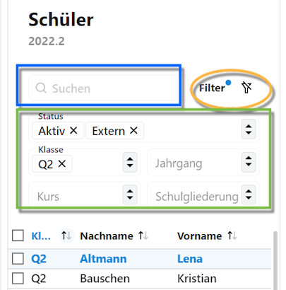
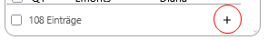

# Schüler

## Aufteilung des Bildschirms

Über die Schaltfläche **Schüler** erreichen Sie alle für einen Schüler oder eine Schülerin relevanten Daten. Diese reichen von den Individualdaten über die Daten zu Stundenplan, Laufbahn bis hin zu den Leistungsdaten.  

Der Schülerbildschirm zeigtauf der **linken Seite** alle ausgewählten Schüler, per Standard ist hier zuerst einmal die ganze Schule ausgewählt.

Auf der **rechten Seite** erscheinen die Daten zum ausgewählten Datensatz einer Person.

## Die Schülerauswahl

Um die angezeigten Schüler einzugrenzen, bietet die Schülerauswahl auf der linken Seite eine Reihe von Möglichkeiten:

Über das im Screenshot blau markierte Feld lässt sich **suchen**. Hierbei wird die Eingabe sowohl mit den *Vor-* als auch mit den *Nachnamen* abgeglichen und die Schülerauswahl wird auf die Funde reduziert.

Im grünen Viereck sind die **Filter** aufgeführt.

* Mit dem Filtern auf den **Status** kann man bspw. aktive oder auch Schüler mit Abschluss auswählen. Per Standard werden die Aktiven und Externen Schüler angezeigt, welche die im normalen Schulbetrieb befindlichen Personen abbilden.
\
Es lassen sich auch mehrere Status gleichzeigt anwählen.
  * Im Zuge der Aufnahme lassen sich Personen im Status *Warteliste* parken. Personen, die für das kommende Schuljahr aufgenommen wurden, erhalten den Status *Neuaufnahme*.
  * Schüler, die ihre Bildungslaufbahn an der Schule hinter sich haben, verfügen über den Status *Abgang* oder *Abschluss*. Letzteren Status erhalten Sie, wenn sie einen von ihrem vorgesehenen Bildungsgang erhaltenen Abschluss erlangt haben.

* Weiterhin lassen sich die Schüler auf **Jahrgänge** und/oder **Klassen** filtern.
* Ebenso stehen die eingerichteten **Kurse** zur Auswahl.
* Verfügt die Schule über mehr als eine **Schulgliederung**, ist eine Filterung auf diese ebenfalls möglich.

Über die Schaltfläche Filter (organgfarbenes Oval im Screenshot) lässt sich der Filter wieder aufheben: Dass die aktuelle Auswahl gefiltert wurde, wird über einen blauen Punkt hinter *Filter* kenntlich gemacht. Klicken Sie auf den durchgestrichenen Filter, um den Filter zurückzusetzen und wieder die ganze Schule angezeigt zu bekommen.

  Im Fuß der Schülerliste wird die Summe der Personen in der Auswahl angezeigt.

  

::: tip Ist ein Filter aktiv? Wenn die Schülerzahl der Schule oder des Jahrgangs bekannt ist, ist hier auch ersichlich, dass gerade ein Filter aktiv ist.
:::

  ----

  Manche Funktionen lassen eine **Aktion für mehrere Personen** zu.

  Wählen Sie dafür die betreffenden Schülerinnen und Schüler über die Checkboxen ☑ an oder ab.
  Die zur verfügung stehenden **Gruppenprozesse** werden dann auf der rechten Seite eingeblendet.
  
## Schüler hinzufügen (noch nicht implemeniert)

Am unteren Ende des Schülercontainers ist die Schaltlfäche (+) zu finden, mit der man eine Schülerin oder einen Schüler der Datenbank hinzufügen kann (s. Screenshot).

Der Client zeigt dann ins Schnelleingabe-Fenster mit dem Titel "Neuen Schüler anlegen..." an. Hier werden zunächst die grundlegenden Daten für die Neuaufnahme eingetragen.
