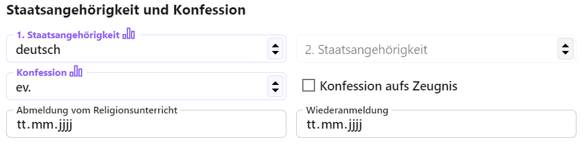
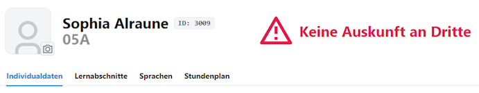

# Schüler

In der App **Schüler** werden die zahlreichen Daten zu den Schülern erfasst.

Im ersten Tab finden sich die persönlichen **Individualdaten**.

::: warning Statistikrelevante Felder beachten
Beachten Sie unbedingt die *statistikrelevanten* Felder. Werden diese korrekt ausgefüllt, werden Fehler bei der Statistik oder diversen Berechnungen zu Abschluss und Schulpflicht vermieden.
:::

## Allgemein

Erfassen Sie **Namen** und **Rufname** der Schüler. Die Auflistung *aller* Vornamen wird im Feld **Alle Vornamen** aufgenommen, so dass alle offiziellen Namen - etwa nach der Geburtsurkunde - auf Abschlusszeugnissen ausgegeben werden können.

Im Feld **Geschlecht** sind die Werte *männlich*, *weiblich*, *divers* oder *Ohne Angabe* auswählbar.

Zu den Geburtsdaten lassen sich **Geburtsdatum**, der **Geburtsort** und eineventuell abweichender **Geburtsname** aufnehmen.

## Wohnort und Kontaktdaten

Über die Kontaktdaten werden eben diese Daten der Schüler erfasst.

Nach der Einschulung kann hier auch die **schulische E-Mailadresse** zur Kommunikation hinterlegt werden.

## Staatsangehörigkeit und Konfession

Tragen Sie die **Staatsangehörigkeit** ein. Die deutsche Staatsangehörigkeit wird immer als **1. Staatsangehörigkeit** aufgenommen und diese ist auch die einzige der beiden, die *statistikrelevant* ist.

Beachten Sie beim Eintrag der **Konfession** auch die aktuellen Vorgaben zu dieser, die den Schlüsseltabellen beziehungsweise den Eintragungshilfen zur amtlichen Schulstatistik von IT.NRW zu entnehmen sind.

Die Konfessionen werden in ihrem Katalog statistikonform aufgenommen.

Haken Sie über **Konfessione aufs Zeugnis** an, ob die Konfession über die Zeugnisformulare ausgebene werden soll oder nicht.

Ist ein Schüler über die Konfession automatisch einem Religionunsunterricht zugeordnet oder diesen eben nicht, werden die **Abnmeldungen vom Religionsunterricht** und **Wiederanmeldungen** über diese Datumsfelder erfasst.

Die Felder sind statstikrelevant, liegen aber keine Meldungen vor, sind auch Leereinsträge zulässig.

## Migrationshintergrund

Ist der Haken bei **Migrationshintergrund vorhanden** gesetzt, können die Herkunftsdaten des Schülers erfasst werden.

Erfassen Sie **Zuzzugsjahr**, **Genurtsland** und die **Verkehrssprache** in der Familie. Weiterhin die Geburtsländer der Eltern.

Hat ein Schüler einen Migrationshintergrund, sind diese Daten statistikrelevant.

## Statusdaten

Im nächsten Bereich werden die Daten zum aktuellen Schulbesuch erfasst.

Der **Status** gibt an, ob der Schüler an der Schule gerade unterrichtet wird oder nicht. Weiteres folgt weiter unten.

Sie können auch die **Fahrschüler**-Art erfassen und für den Schüler eine im Katalog definierte Art wählen. Ebenso lassen sich **Haltestellen** zuordnen.

Weiterhin werden mit dem **Anmeldedatum** das Datum der Schulanmeldung und das **Aufnahmedatum** erfasst.

Das Aufnahmedatum ist in der Regel der Beginn des Schuljahres, ansonsten das Datum, an dem bei einem Wechsel im laufenden Schuljahr die offzielle Beschulung begann.

Die Felder, ob ein Schüler **Volljährig** ist ider die **Schulpflicht** erfüllt wurde, werden automatisch ausgefüllt. Analog gilt dies auch für die Schulpflicht der SII.

Setzen Sie die Haken bei **Masern Impfnachweis** und **BAFöG** nach Bedarf.

Über **Keine Auskunft an Dritte** lässt sich ein Datensatz so markieren, dass besondere Vorsicht bei Auskunftsanfragen walten zu lassen ist.

Der **Status** gibt an, welche Rolle die Person im Schulbetrieb spielt.

* Schüler in der **Neuafaufnahme** sind an der Schule aufgenommen, aber noch nicht aktiv einer Klasse zugeordnet. In der Regel finden sich hier die Schüler, die aufgenommen werden, aber erst im kommenden Schuljahr dem Regelbetrieb zugeordnet werden.
* Haben Sie Schüler, die noch nicht aufgenommen sind, aber für die dies eventuell noch geschehen könnte, können Sie die grundlegenden Daten, etwa zum Kontaktieren erfassen. Weisen Sie diesen Schülern den Status **Warteliste** zu.
* Die aktuell beschulten Schüler sind **Aktiv**.
* Eventuell haben Sie aktive Schüler, die aber gerade **Beurlaubt** sind. Diese werden mit dem entsprechend Status markiert.
* **Externe** Schüler sind an einer anderen Schule gerade aktiv, werden aber bei Ihnen teilweise unterrichtet. Ein Beispiel wäre etwa ein über eine Kooperation zustande gekommener Leistungskurs.
* Erreichen Schüler den Abschluss Ihres Bildungsganges oder Ihrer Prüfungsordnung, beenden Sie die Schulkarriere mit dem Status **Abschluss**.
* Geht ein Schüler ohne den vorgesehenen Abschluss zu erreichen, etwa mitten im Schuljahr oder am Ende des Schuljahres ohne diesen Abschluss oder verlässt aus irgendeinem anderen Grund die Schule, wird er mit dem Status **Abgang** versehen.
* Unter dem Status **Ehemalige** können die Rumpfdaten von Schülern erfasst werden, für die geltende Löschfristen abgelaufen sind. Über diesen Status können Kontaktdaten vorgehalten werden, um zum Beispiel Ehemaligentreffen zu organisieren.
