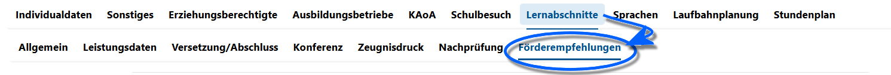
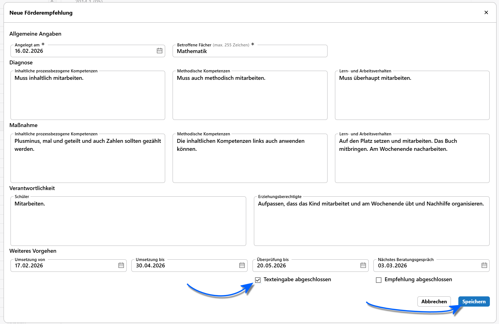

# Förderempfehlungen für Schüler

Verwalten Sie die Förderempfehlungen über die **App Schüler** und dort mit dem **Tab Lernabschnitte ➜ Förderempfehlungen**.

Auf der linken Seiten finden Sie in der Auswahlliste alle Lernabschnitte. Für jeden Lernabschnitt lassen sich die Förderempfehlungen verwalten.

Wurde ein Lernabschnitt angewählt, lässt sich über das **Plus +** eine Förderempfehlung anlegen. Mit dem **Mülleinmer 🗑** kann eine existeriende Förderempfehlung gelöscht werden.

Im Beispiel oben finden Sie ein Beispiel den auszufüllenden Inhalten. Die Angabe der **Fächer**, für die diese Maßnahme gilt, ist verpflichtend, andere Felder sind optional auszufüllen.

In den drei Feldern zur **Diagnose** ist diese kompetenzorientiert aufzunehmen. Unter **Maßnahme** und **Verantwortlichkeit** werden konkrete Maßnahmen festgehalten, wie die gewünschten Kompetenzbereiche erreicht werden können. Unter Verantwortklichkeit lassen sich eben diese und auch konkrete Maßnahmen in Bezug auf die **Schüler** und **Erziehungsberechtigten** festhalten.

Am Ende des Fensters wird über unterschiedliche Daten das **weitere Vorgehen** verschriftlicht. Die Maßnahme soll in einem **Zeitraum von... bis** umgesetzt werden. Ebenso können optinale Daten zur **Überprüfung** und dem **Nächsten Gespräch** erfasst werden.

Ist die Fördermaßnahme vollständig formuliert, klicken Sie auf **Texteingabe abgeschlossen**.

Beachten Sie hier, dass die Daten erst in die Datenbank geschrieben werden, wenn Sie auf `Speichern` klicken. Klicken Sie auf **Abbrechen** werden alle Eingaben verworfen. 