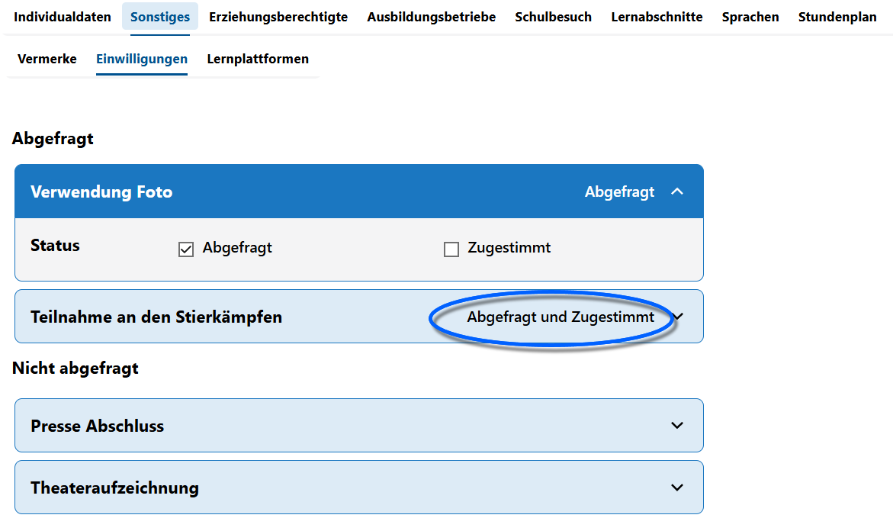

Einwilligungen (Schüler)

Verwalten Sie die *abgefragten* und *gegebenen* **Einwilligungen** von Schülern in der **App Schüller** über den **Tab Sonstiges ➜ Einwilligungen**.

Klappen Sie über den kleinen Haken rechts bei jeder Einwilligung den Bereich auf und setzen Sie die Haken bei *Abgefragt* beziehungsweise bei *Zugestimmt*.

Alle Einwilligungen, bei denen kein Haken gesetzt ist, werden unten gruppiert, alle mit mindestens einem Haken sind oben unter **Abgefragt** zu sehen.

Wurde ein Haken gesetzt wird im Titel der Einwilligung dieser Status als Text angezeigt, im Screenshot ist bei *Verwendung Foto* einmal *Abgefragt* und bei *Teilnahme an Stierkämpfen* auch *Abgefragt und Zugestimmt* zu lesen.

Neue Einwillungsarten werden über die **App Schule** im **Katalog Einwilligungen** erzeugt. Dort können keine Einwilligungen gelöscht oder verändert werden, die schon bei mindestens einer Schülerin gesetzt sind. Ebenso lassen sich dort Einwilligungen für Lehrkräfte erfassen.

