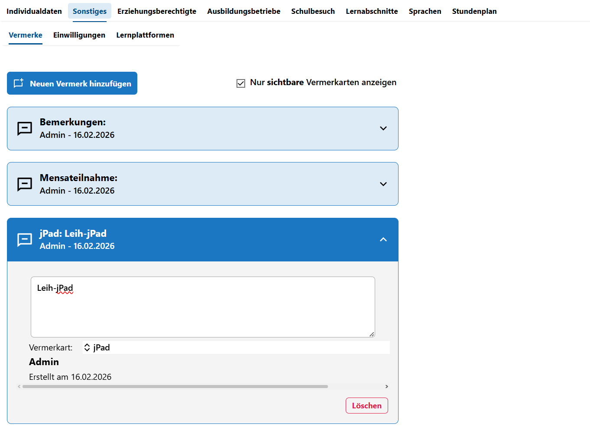

Vermerke bei Schülern setzen

Setzen Sie in der **App Schüler** über den **Tab Sonstiges Vermerke** beliebige Anmerkungen zu Schülern.

Vermerke werden durch **Vermerkarten** gegliedert und sortiert. Neue Vermerkarten lassen sich über die **App Schule** im **Katalog Vermerkarten** erzeugen. Eine Vermerkart, die (noch)) bei einer Person gesetzt ist, kann im Katalog nicht mehr verändert oder gelöscht werden.

In der Übersicht sind alle gesetzten Vermerke zu sehen. Über **Neuen Vermerk hinzufügen** lässt sich eben dies tun. Der Haken bei **Nur sichtbare Vermerkarten** steuert, dass Vermerkarten, die nachträglich im Katalog durch Entfernen des Hakens als *nicht sichtbar* markiert sind, hier auch nicht mehr angezeigt werden. Entfernen Sie den Haken, um alle gesetzten Vermerke anzuzeigen.

Nachdem ein Vermerk hinzugefügt wurde, muss nichts mehr gespeichert werden. Ein Klick auf **Löschen** entfernt den Vermerk wieder.

Im freien Textfeld lassen sich beliebige Informationen erfassen.

Darunter ist die **Vermerkart** aus einem Dropdown-Menü zu wählen. Wird kein Eintrag gewählt, lautet die Vermerkart *Neuer Vermerk*.

Unterhalb der Vermerkart ist der **Nutzer** zu sehen, durch den ein Vermerk angelegt wurde. Hier im Beispiel ist das *Admin*. Ebenso wird das **Datum der Erstellung** angezeigt.

::: caution Datenschutz
Vermerke sind mächtig und verlockend - beachten Sie aber bitte unbedingt die geltenden Rahmenbedindungen zum Datenschutz, zum Beispiel aber nicht ausschließlich die VO DV1 und VO DV2.
:::