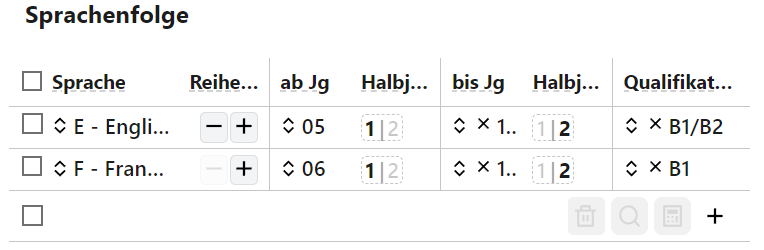

# Sprachen

Im Reiter **Sprachen** werden diese der Schülerinnen und Schüler erfasst.

# Sprachenfolge

Im Bereich der Sprachenfolgen werden die von Schülern belegten Sprachen in der Reihenfolge ihrer Belegung erfasst. Diese **Reihenfolge** lässt sich über **+** und **-** verändert. In der Regel beginnt die Sprachausbildung mit *Englisch*.

Der Beginn eines Sprachenunterrichts wird mit **ab Jg** und dem **Halbjahr** ausgezeichnet. Entprechend wird auch das Ende **bis Jg** und dem zugehörigen **Halbjahr** eingetragen.

 

Handelt es sich um eine Sprache, die dem *gemeinsamen europäischen Referenzrahmen GeR* zugehört, wird das **Refernznvieau** nach diesem Referenzrahmen eingetragen.

Über das **+** können neue Sprachen eingetragen werden. Wurden Sprachen über die **Checkbox** markiert, lassen sie sich über den roten Mülleimer 🗑 **löschen**.

## Sprachprüfungen 

Bei Sprachprüfungen lässt sich die **Sprache** angegeben, weiterhin um welche **Prüfungsart** es sich handelt. Bei einer Prüfung kann es sich um den *Herkunfssprachenlichen Unterricht* (HSU) oder eine *Feststellungsprüfung* handeln. Beachten Sie zum HSU und die für ihn geltenden Sprachen die aktuellen Rechtsvorschriften.

::: tip Hinweis zur Migration von SchILD-NRW 2
In der Vergangenheit wurden die Sprachprüfungen in der Sprachenfolge hinterlegt. Die Sprachprüfungen werden nun getrennt erfasst. Als Kürzel für die *Prüfungsart* wurden *P* und *N* in der Reihenfolge der Sprachenfolge eingetragen. Jedoch liegt keine verbindliche Dokumentation vor, welcher Schlüssel wann zu verwenden war. Daher gilt für die technische Erfassung im SVWS-Server für die **Sprachprüfungen**: 
* **P** kennzeichnet die *Sprachprüfung im HSU*
* **N** die *Feststellungsprüfung*
:::
