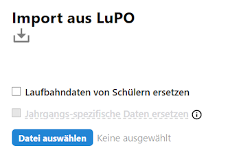

# Import aus LuPO

::: info LuPO und WebLuPO
Die hier beschriebene Funktion bezieht sich auf den Import von Beratungsdateien aus dem bisherigen Windows-Programm "LuPO" Importieren Sie WebLuPO-Daten über die **App Oberstufe**.
:::

::: warning Gültige Schüler-IDs
Alle Schüler aus der LuPO-Datei müssen über gültige Schüler-IDs verfügen. Achten Sie hier besonders auf Schüler, die nach dem Initialexport händisch in LuPO angelegt wurden.
:::

Im Dateiwahldialog des Imports ist die Lehrerdatei ".lup" anzugeben, in der schon alle Schülerwahldateien durch einen Import in LuPO zusammengestellt wurden. Dieser Importdialog liest keine Schülerwahldateien ".lp" ein!

Wählen Sie, ob die importieren Laufbahndaten von Schüler ersetzt werden sollen. Üblicherweise ist der Haken zu setzen.

Wurde der obere Haken angewählt, können Sie auch Daten ersetzen, die eigentlich in den WebLuPO-Dateien durch die Schule vorher eingestellt wurden. Dies betrifft 
+ Texte für den Beratungsbogen
+ Wählbare Fächer
+ Einstellungen zu Zusatzkursen
+ Unzulässige Fachkombinationen
+ Geforderte Fachkombinationen

Letztere Option wäre zu wählen, wenn Sie über eine LuPO-Datei diese Einstellungen extern vorgenommen haben und diese nun für den Jahrgang in den SVWS-Client übernehmen wollen.

Mit dem Klick auf `Datei wählen` können Sie wie in Ihrem Betriebssystem üblich die Lehrer-.lup-Datei im gewählten Ordner auswählen und importieren.