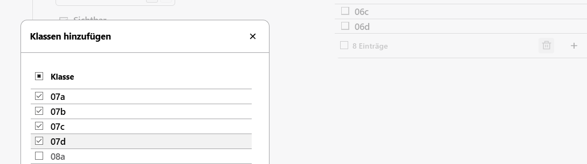
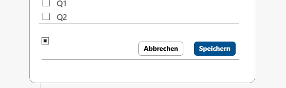

# Abteilungen

Wenn eine Schule in Abteilungen gegliedert ist, lässt sich diese Strutkur im Katalog **Abteilungen** ablegen.

Solche Schulen sind zum Beispiel Gesamtschulen (etwa Jahrgänge 5 und 6, 7 und 8, 9 und 10 und dann die GOsT), Berufskollegs oder Gymnasien (Erprobungsstufe, Mittelstufe, Oberstufe).

In der Auswahlliste lassen sich existierende Abteilungen auswählen oder legen Sie eine neue Abteilung durch das **Plus +** im Fuß der Liste an.

In den Details rechts sind die Daten der Abteilungsleitung oder Koordination einzustellen. 

Haben Sie eine **Lehrkraft** ausgewählt, können Sie über das **Linksymbol 🔗** direkt dorthin springen. Weiterhin lassen sich die **Bezeichnung**, **Raum**, **Email**, **Durchwahl** und die Sortierung für die Reihenfolge der Katalogeinträge festlegen.

Wie in Katalogen üblich können Einträge auch auf Nicht-**Sichtbar** gestellt werden, indem der Haken in der entsprechenden Checkbox entfernt wird.

Im Bereich **Zugeordnete Klassen** können diese markiert und über den **Mülleimer 🗑** entfernt werden. 

Mit dem **Plussymbol +** öffnet sich eine Liste, in der Klassen angewählt werden, um diese der aktuellen Abteilung hinzuzufügen. 

Im folgenden Beispiel wurden die Klassen des 7. Jahrgangs angewählt:

Im Bild ist rechts das **+** zu sehen, mit dem der Dialog geöffnet wurde. 

Um diese angewählten Klassen der Abteilung hinzuzufügen, bestätigen Sie mit `Speichern`.

