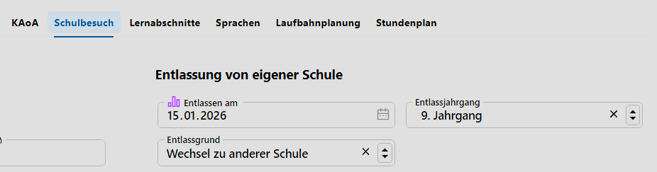

# Entlassgründe

Im Katalog **Entlassgründe** sind die später zu verwendenden Gründe, warum jemand von der Schule entlassen wird, festzulegen.

Hierbei ist zu beachten, dass die **Bezeichnung** mit einem **Schlosssymbol 🔒** versehen ist und daher nach der Anlage des Eintrags nicht mehr verändert werden kann. Somit wird das spätere Umdefinieren eines bei einer Person schon gesetzen Entlassgrunds verhindert. 

## Eine Anwendung als Beispiel

Der Entlassgrund wird in der **App Schüler** unter dem **Tab Schulbesuch** erfasst:

