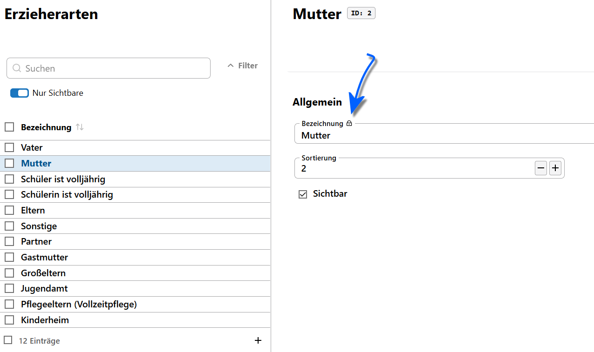
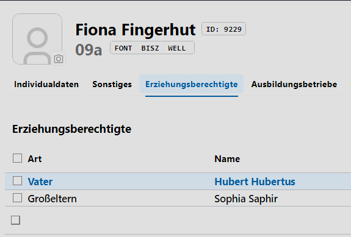

# Erzieherarten

In diesem Katalog werden die **Erzieherarten** festgelegt, die in **Schüler ➜ Erziehungsberechtigte** zur Auswahl stehen.

Beachten Sie hier, dass die Bezeichnung der Erzieherart nach der Anlage nicht mehr geändert werden kann und somit bei Schülerinnen definierte Erzieher nicht über den Katalog zu verändern sind.

Wurde bei der Anlage ein Fehler gemacht, ist der Eintrag anzuhaken und dann mit dem nun auftauchenden **Mülleimer 🗑** zu entfernen. Es kann ein neuer Eintrag angelegt werden.

## Eine Anwendung als Beispiel

Sie können diese Erzieherarten nun in der **App Schule** im **Reiter Erziehungsberechtigte** bei bei den Erzieherdaten setzen:

