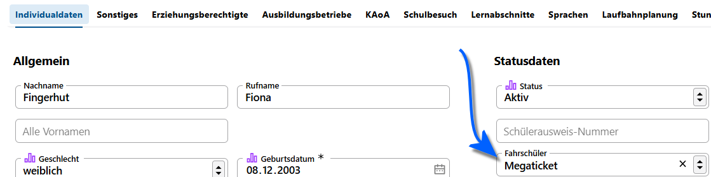

# Fahrschülerarten

Über diesen Katalog werden die Fahrschülerarten definiert, die an Ihrer Schule relevant sind. 

Legen Sie einen neuen Eintrag mit dem **Plus +** fest.

## Eine Anwendung als Beispiel

Die konkrete Fahrschüler-Art lässt sich unter **Schüler ➜ Individualdaten** eintragen:

