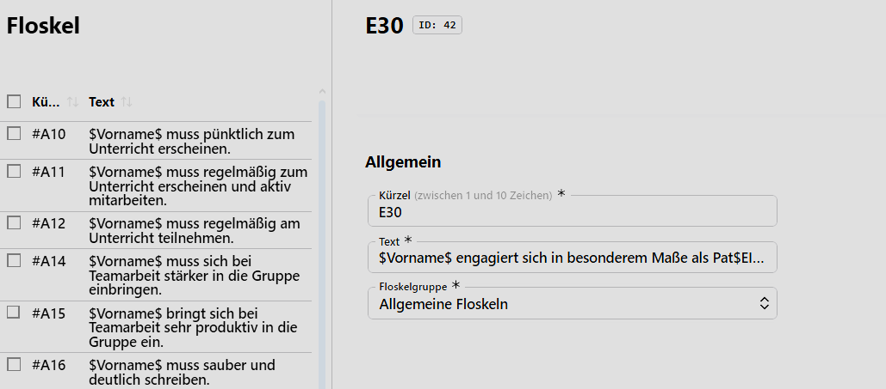

# Floskeln

Für Zeugnisse, fachbezogene Bemerkungen, Förderschwerpunkte, Vermerke oder Ähnliches lassen sich vorgerfertigte **Floskeln** definieren.

Diese Floskeln sind dann schnell und einheitlich in für sie vorgesehenen Feldern verwendbar und lassen auch zu, dass automatisch Platzhalter wie den Vornamen einer Person eingefügt werden.

Details zu Floskeln bestehen aus einem **Kürzel**, das bei Eingabe im entsprechenden Feld automatisch den **Text** der Floskel einfügt. 

Abschließend ist eine **Floskelgruppe** festzulegen. Die zur Verfügung stehenden Floskelgruppen werden im **Katalog Floskelgruppen** definiert.

Die Floskelgruppen dienen dazu, die Floskeln vorzufiltern, so dass einem Feld nur die für dieses Feld relevanten Floskeln zur Verfügung stehen beziehungsweise nach ihnen durch den Nutzer gefiltert werden kann.

Zum Beispiel könnte eine Floskel so aussehen

    Kürzel: SVM
    Text: $Vorname$ ist Mitglied der Schülervertretung.
    Floskelgruppe: Zeugnisbemerkungen

Die folgende Floskel richtet sich auch dynamisch nach dem eingestellten Geschlecht der Person:

    $Vorname$ engagiert sich in besonderem Maße als Streitschlichter$WEIBL$.

Hierbei würde je nach Geschlecht $Streitschlichter$ oder $Streitschlichterin$ generiert werden. Gleichermaßen würde in

    $Vorname$ engagiert sich in besonderem Maße als Pat$EIN$ bei der Betreuung jüngerer Schüler/innen.

das Geschlecht das Wort $Pate$ oder $Patin$ generieren.

Für die Erstellung von Floskeln stehen die folgenden Platzhalter zur Verfügung, Groß- oder Kleinschreibung werden ignoriert:

    $vorname$   - gibt den Vornamen der Person aus.
    $nachname$  - gibt den Nachnamen aus.
    $weibl$     - erzeugt gegenenfalls ein "in".
    $ein§       - generiert je nach Geschlecht "e" oder "in".
    $seinihr$   - generiert "sein" oder "ihr".
    ... weitere??? 

> [!IMPORTANT] Beachten Sie Datenschutzbestimmungen und andere Vorgaben
> Beachten Sie bitte beim generieren von Floskeln und Floskelgruppen die geltenden Bestimmungen zum Datenschutz und/oder eventuell geltende Bestimmungen, ob Floskeln für Verwendungen/Floskelgruppen durch Gremien wie Fachkonferenzen oder die Schulkonferenz festzulegen sind.