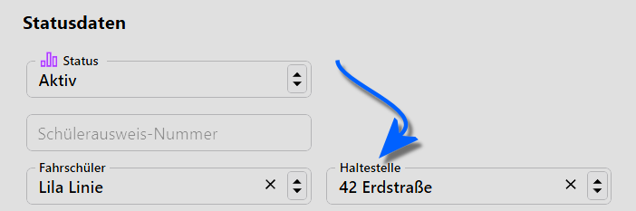

# Haltestellen

In diesem Katalog können **Haltestellen** erfasst werden, die anschließend in den Individualdaten genutzt werden können.

In die **Bezeichnung** kann bei Bedarf die zugehörige Linie aufgenommen werden.

Geben Sie eine **Entfernung zur Schule** an. In diesem Feld sind reine Zahlenwerte zu erfassen. Es können ganze Zahlen und Kommawerte aufgenommen werden, hier ist also zu entscheiden, ob die Entfernung in Metern, Kilometern oder als irgendwo hinterlegte Zonen aufgenommen werden sollen.

## Eine Anwendung als Beispiel

Setzen Sie die Haltestelle in der **App Schüler ➜ Individualdaten** im Bereich der *Statusdaten*:

