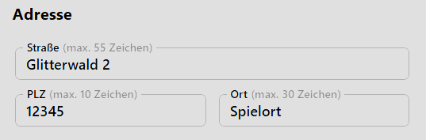
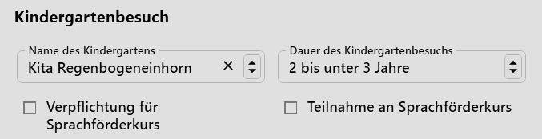

# Kindergärten

Erfassen Sie als Grundschule oder Schule mit einer Primarstufe die **Kindergärten**, von denen die Kinder kommen.

Neben der **Bezeichnung**, den **Bemerkungen** und den Kontaktdaten sind auch die Adressdaten zu erfassen.

## Eine Anwendung als Beispiel

An einer Grundschule ist der Kindergarten in der **App Schüler Schulbesuch** im Bereich **Kindergartenbesuch** einzutragen.

