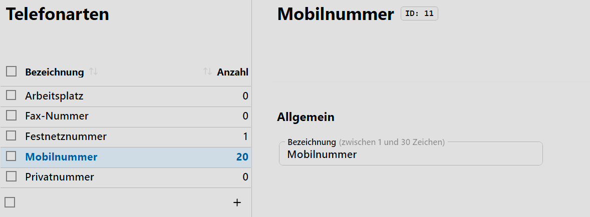
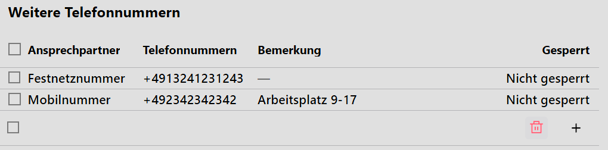

# Telefonarten

In diesem Katalog werden die **Telefonarten** erfasst, die genutzt werden, um Telefon- und Faxnummern zu erfassen.

## Eine Anwendung als Beispiel

In der **App Schüler** können unter den **Individualdaten** im Bereich **Weitere Telefonnummern** Telefonnummern erfasst werden, für die eine Telefonart gewählt werden kann.

