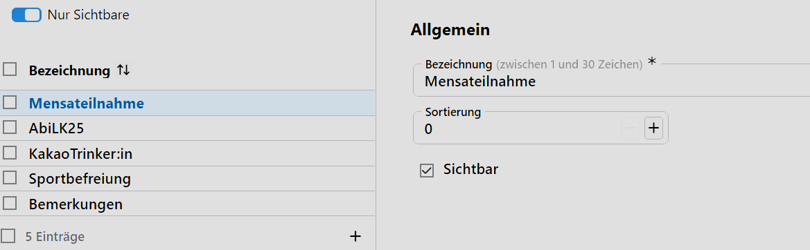

# Vermerkarten

**Vermerke** sind eine sehr flexible and mächtige Möglichkeit, zusätzliche Informationen über Schülerinnen zu erfassen.

Die Vermerke sind über **Vermerkarten** strukturiert, die sich hier im Katalog definieren lassen.

> [!IMPORTANT] Datenschutzbestimmungen beachten
> Beachten Sie bitte schon bei der Anlange von Vermerkarten die geltenden Bestimmungen zum Datenschutz!

## Eine Anwendung als Beispiel

Tragen Sie in der **App Schüler** über **Sonstiges ➜ Vermerke** zusätzliche Informationen bei Schülerinnen ein:

