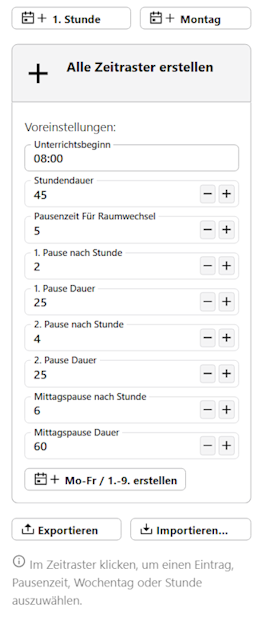
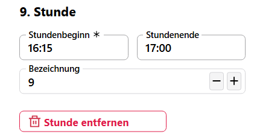

# Stundenplan Allgemein Vorlagen

In der **App Stundenplan** können zuest Allgemein Vorlagen definiert werden, mit denen sich dann konkreten Stundenpläne erstellen lassen.

Als eine solche Vorlage bietet es sich somit an, das Zeitraster der Schule mit den Stunden- und Pausenzeiten anzulegen und zu speichern. 

## Raster als Vorlage erstellen

Sie können die allgemeine Vorlage manuell zusammenstellen, indem Sie mit den Feldern *"+ 1. Stunde"* und *"+ Montag"* Stunden und Tage erstellen.

Alternativ können Sie das grundlegende Raster mit Stunden, Wechselpausen und Pausen über den Knopf *+ Alle Zeitraster erstellen* generieren und dann weiterbearbeiten.

Konfigurieren Sie die Daten, wann Unterrichtsbeginn ist, welche Raumwechselzeiten Sie vorsehen und wann die Pausen mit welchen Längen sind.

Dann klicken Sie auf `+ Mo-Fr / 1.-9. erstellen`.

Alternativ kann ein existierende Raster *importiert* werden beziehungsweise ist es möglich, dass gerade erstelle zu *exportieren*.

## Ein Raster bearbeiten

Das nun erstellte Stundenplanraster kann nun weiter bearbeitet werden. Sie können zum Beispiel nicht benötigte Stunden am Ende für alle Wochentage auf einmal löschen. Klicken Sie hierzu die Stunde ganz links an und klicken Sie rechts auf **Stunde entfernen**.

Im Screenshot wurde die 9. Stunde ganz links angewählt und somit lässt sie sich in allen Wochentagen auf einmal löschen oder verschieben.

Alternativ lässt sich die Stunde bearbeiten, in dem die Paramater rechts bearbeitet werden. Damit lassen sich nun auch die Pausenzeiten noch individuell anpassen, verschieben oder ganz löschen.

Dieses Löschen und Bearbeiten lässt sich auch nur für eine Stunde an einem bestimmten Wochentag vornehmen.

Oben rechts lassen sich noch weitere Stunden und Wochentage hinzufügen.

## Stundenraster verwenden

Klicken Sie links in der Auswahliste nun auf das **+**, wird ein neuer Stundenplan auf dieser allgemeinen Vorlage anlegt, dem auch ein **Gültigkeitsbereich** in Bezug auf das Start- und Enddatum zugewiesen werden kann.