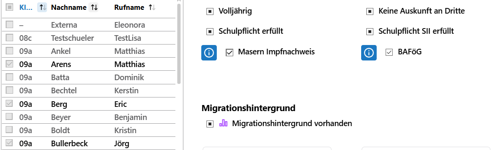
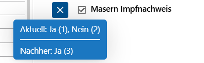

# Gruppenprozesse

In einigen Auswahllisten schaltet der SVWS-Webclient in den Modus für die **Mehrfachauswahl** beziehungsweise die **Gruppenprozesse**, sobald über die Checkbox vor dem Eintrag mindestens eine Eintrag ausgewählt wurde.

Der Modus für das Bearbeiten von ganzen Gruppen ist im SVWS-Webclient direkt in jede App integriert.

Hier im Beispiel werden in der **App Schüler** mehrere Personen durch Setzen des Hakens vor ihrem Eintrag ausgewählt. Über diese Mehrfachauswahl kann nun der Gruppenprozess ausgeführt werden.
 

Ist der Modus für die Mehrfachauswahl aktiviert, können Sie im Kopf sehen, welche Schüler aktiviert sind. Weiterhin ist direkt im Kopf die Option gegeben, den Modus mit **Auswahl aufgeben** direkt zu verlassen.

Klicken Sie auf **Speichern** um die gemachten Änderungen in die Datenbank zu schreiben oder auf **Zurücksetzen**, damit eventuell gemachte Änderungen verworfen werden, ohne dass es zu einer Änderung an den Daten kommt.

Wurde eine Mehrfachauswahl getroffen lassen sich nun Änderungen auswählen, die nach einem Klick auf **Speichern** in die Daten der Schüler geschrieben werden.

::: tip Die Auswahlliste ist nun ausgegraut
Beachten Sie, dass nun bis zum Abschluss der Operation keine neuen Personen mehr dazu- oder abgewählt werden können.
:::

Fährt man mit der Maus über das blaue Informationssymbol, das neben jedem Eintrag anzeigt wird, öffnet sich ein Informationsfenster, dem die Anzahlen der *bisherigen Werte* und der *neuen Werte* zu entnehmen sind.

Nun können die Änderungen durch einen Klick auf **Speichern** geschrieben beziehungsweise über die anderen beiden Auswahlen im Kopfbereich verworfen werden.