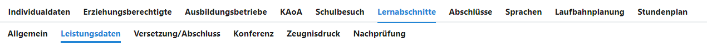
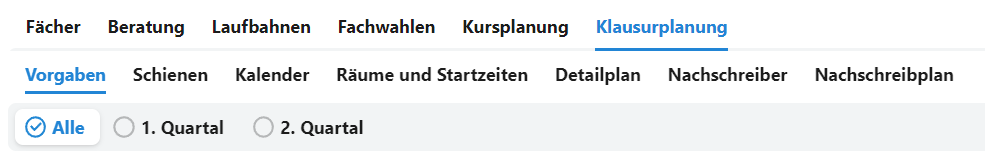
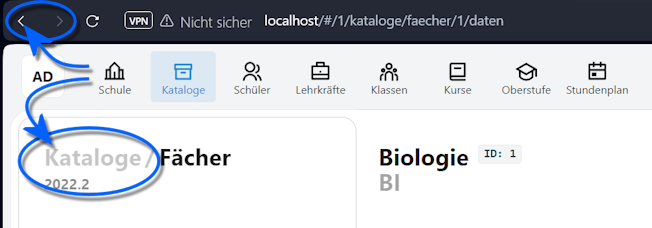
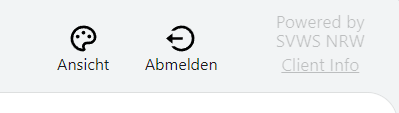
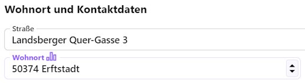
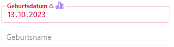

# Bedienkonzept des SVWS-Clients

Die offiziell unterstützte minimale Auflösung für die Verwendung des SVWS-Clients ist FullHD (1920 * 1080 Pixel). Nach modernen ergonomischen Gesichtspunkten für Bildschirmarbeitsplätze werden Monitore mit einer Mindestgröße von 21", besser 23", empfohlen.

## Wesentliche Bedienbereiche des SVWS-Clients

Die Programmpunkte im SVWS-Client heißen **Apps**.

Je nach Schulform werden mitunter andere Apps angezeigt.

In einer App werden nach Bedarf **Tabs** angezeigt.

Die Tabs können sich auch dymanisch ändern, etwa je nach Jahrgang wird KAoA ein- oder ausgeblendet.

Verzweigen sich die Tabs, werden **Untertabs** eingeblendet.

Hier die Untertabs können sich dynamisch verändern, zum Beispiel werden bei den Lernabschnitten je nach Bedarf die Untertabs zu Abschlussberechnungen eingeblendet.

### Auswahllisten

Gibt es etwas in einer Hauptliste auszuwählen, ist dies die **Auswahlliste**.

Eventuell kann es auch zwei Auswahllisten geben. In der zweiten Auswahllisten wird eine weitere Unterauswahlen getroffen. In der Klausurplanung zum Beispiel wäre erst ein Jahrgang, dann ein Halbjahr für diesen zu wählen.

An vielen Stellen lassen sich Listen mit dem Listeneinklappsymbol  einklappen, um mehr Platz für die Detailansichten zu haben. Möglichweise besonders hilfreich kann das in der **App Blockung** sein.

### Gruppenprozesse

In vielen Gruppenprozessen können über **Checkboxen ☐** links der Einträge mehrere oder auch alle Einträge der Liste gewählt werden.

Wird mindestens eine Checkbox aktiviert, schaltet der Client automatisch in den Modus für **Gruppenprozesse**. Die für diese Auswahl möglichen Gruppenprozesse werden dann auf der rechten Seite im Detailbereich angezeigt.

## Weitere Bedienbereiche

In einigen Bereichen gibt es nach den Untertabs noch eine weitere Unterteilung. Diese Zeile ist die **Schaltflächenleiste**.

Eventuell stehen dann noch weitere Auswahllisten zur Verfügung. Hier im Beispiel nimmt diese Liste die Form einer **Tabelle** an, aus der die Fächer gewählt werden können.

Weiterhin können manche Bereiche als **Kacheln** oder auch **Cards** angeordnet und anwählbar sein.

## Bedienung des SVWS-Clients

Der SVWS-Client wird über einen üblichen Internet Browser ausgeführt und arbeitet mit den großen Render-Engines für Browser zusammen.

### Navigation

* Kehren Sie über den Browser über die **zurück**-Schaltfläche zu einer vorherigen Seite zurück.
* Wurde über das linke Inhaltsverzeichnis ein Unterpunkt aufgerufen, lässt sich darüber eine vorherige Ebene anwählen.

Sofern Personen - wie Lehrkräfte oder Schüler - in Auswahllisten angezeigt werden, findet sich an vielen Stellen ein **Linksymbol 🔗**, über das direkt zu dieser Person gesprungen werden kann.

::tip Oberstufenberatiung
Diese Symbole finden  besonders in der **App Oberstufe** bei der Laufbahnberatung sehr nützlich.
:::

### Zoom

Die Funktionen des Browsers werden somit direkt unterstützt, zum Beispiel können Sie das Fenster **zoomen**. Klicken Sie hierzu auf die Zoom-Schaltflächen Ihres Browers oder drücken Sie **Strg und +** oder **Strg + und -**. Über die Maus können Sie Zoomen, indem Sie **Strg** und mit dem **Mausrad hoch** oder **runter** rollen.

### Skalierung

In der SVWS-Oberfläche lässt sich weiterhin unter **Ansicht** die **Skalierung** auf *kleiner*, *normal* oder *größer* stellen.

### Kontraste

**Dark Mode:** Ebenso lässt sich im SVWS-Client ein *helles* oder *dunkles* Thema wählen. 

### Fensterbreite des SVWS-Clients

Das Fenster passt sich an die Breite des Browserfensters an. 

Die Schaltflächen zum Abmelden und Ändern der Ansicht finden sich je nach Broweserbreite oben rechts oder unten links. Weitehrin wird hier die Version des SVWS-Clients über die Client-Info angezeigt.

### Statistikrelevante Felder

Im SVWS-Client werden Felder, die für die **Amtliche Schulstatistik** relevant sind, farblich und mit einem kleinen Icon gekennzeichnet:

Hier im Beispiel wäre die *Straße* eines Lernenden nicht relevant für die Statistik, der *Wohnort* hingebgen schon. 

Bitte füllen Sie diese Felder direkt so korrekt wie möglich aus und korrigieren Sie Einträge im Vorfeld der Statistik, um dann im Statistikzeitraum schon im Vorfeld für Entlastungen gesorgt zu haben.

::: tip Tipp
Schauen Sie in die Schüsseltabellen und Eintragungshilfen von IT.NRW zur Statistik, oftmals lassen sich Fragestellungen durch eine klare Vorgabe direkt lösen.
:::

### Plausibilitätsfehler

An manchen Stellen werden offensichtliche Plausbilitätsfehler durch ein rotes Feld markiert. 

Hier im Beispiel ist ein Geburtsjahr in einer Datenbank von 2022 nicht plausibel.

### Plugins im Browser

Im Browser installierte Plugins, etwa Screenreader, lassen sich somit auch mit dieser Webseite und im SVWS-Client verwenden.

::: info Drittsoftware
Für Drittsoftware wird kein Support unternommen und ein reibungsloses Funktionieren eines externen Plugins mit den Inhalten des SVWS-Clients kann nicht garantiert werden.
:::

## Technische Hintergründe zu den unterschiedlichen Nuterarten

Es gibt den **Datenbank-root**, dem **Datenbank-Admin** und die tatsächlichen **SVWS-Benutzer**.

* Ein **normaler Nutzer** ist (meistens) eine reale Person mit individuellen Zugriffsrechten. An Nutzer vergebene *Rechte* regeln individuell für jeden Nutzer, welche Operationen auf der Datenbank erlaubt sind. Dies sind die Benutzer, über die mit den Daten gearbeitet wird. Einem solchen Benutzer können je nach verwendeten Client, etwa SchILD NRW 3, "Administratorrechte" zugewiesen werden, um zum Beispiel die Datenbank zu sichern und wiederherzustellen. Dieser Typ von Benutzer ist der einzige, mit dem im täglichen Betrieb gearbeitet wird. Die anderen Nutzer sind nur technisch relevant:

* Der **Root-Benutzer** der MariaDB ist ein Super-Administrator-Zugang auf den MariaDB-Server an sich. Er hat Zugriffsrechte auf alle Datenbanken auf dem Server und kann diese anlegen und löschen. Er kann beliebige weitere Datenbank-Administratoren anlegen. Im täglichen Betrieb wird dieser Nutzer nicht benötigt und häufig wird nur die IT diesen Nutzer haben. Geht das Root-Kennwort für die MariaDB verloren, kann dieses Passwort nicht mehr angezeigt oder verändert werden und neue Schemata können nicht mehr angelegt werden.

* Ein **Schema-Benutzer** ist ein Administrator-Zugang mit vollen Zugriffsrechten auf ein bestimmtes Schema, das heißt eine einzelne "Datenbank". In den Beispielen hier wird dieser oft *svws_admin* oder *svwsadmin* genannt. Ein Datenbank-Benutzer kann auch mit gleichem Namen und Passwort für mehrere Schemata/Datenbanken gelten. Er kann diese Datenbank nicht löschen, aber jede Veränderung innerhalb des Schemas/der Datenbank vornehmen. Zum Beispiel nutzt ein Client wie SchILD-NRW 3 diese Zugangsdaten, um auf die Datenbank zuzugreifen. Auch dieser Nutzer wird im täglichen Betrieb in der Regel nicht benötigt.

