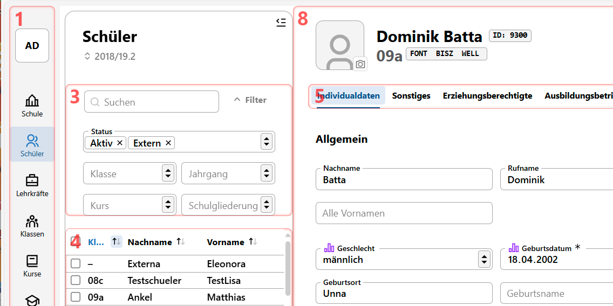
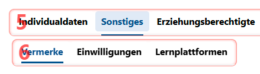
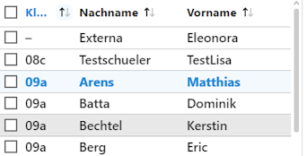
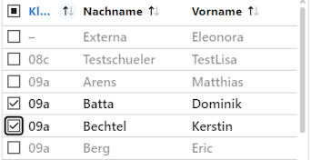
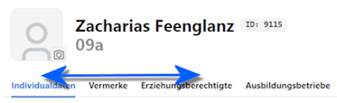

# Navigation über die Tastatur

Der SVWS-Client lässt sich auch über die Tastatur bedienen.

## Schneller Bereichwechsel über Fokusbereiche

Im SVWS-Client lassen sich Fokusbereiche direkt anspringen, indem die zum Bereich gehöhrende Nummer mit `Alt + NUMMER` angewählt wird.



Zeigen Sie mit `Alt + 0` die Fokusbereiche an, ebenso blendet ein weitere Druck auf Àlt + 0`die roten Fokusbereichsrahmen auch wieder aus.

Sie können nun die Bereiche mit Alt und der passenden Zahl direkt anspringen, dort funktionieren die für Browser üblichen Navigationsmöglichkeiten, zum Beispiel können Sie mit `Tab` vor- und mit `Shift + Tab` zurückschalten.

::: info Die Fokusbereiche müssen nicht angezeigt sein, um sie zu erreichen.
Sie können auch die Fokusbereiche direkt anspringen, ohne die Fokusbereiche zuvor angezeigt zu haben.
:::

* `Alt + 1` springt immer in den App-Bereich
* `Alt + 4` in die Auswahlliste und 
* `Alt + 5`, `Alt + 6` und `Alt + 7` springt in die Tabs und dann absteigend in weitere Untertab-Bereiche.



Mit `Alt + 8` können Sie durch alle Fokusbereiche zykolisch durchschalten. Damit lassen sich also auch Fokusbereiche erreichen, die keiner festen Struktur zuzuordnen sind.

## Navigation in Auswahllisten

In **Auswahllisten**, also Schüler, Lehrkräfte, Kurse und so weiter, kann mit ````Pfeiltaste hoch```` und ````Pfeiltaste runter```` durch die Listenelemente oder die zugehörigen Auswahlboxen geschaltet werden.

Ist ein *Listenelement* fokussiert, wird durch die Pfeiltasten das nächste beziehungsweise das vorherige Listenelment fokussiert.

Ist eine *Auswahlox* fokussiert wird durch die Pfeiltasten der Fokus auf die nächste beziehungsweise vorherige Auswahlbox gesetzt.

Mit ````Tab```` kann zwischen der Wahl der *Auswahlboxen* und der *Listenelemente* umgeschaltet werden. Das heißt, ist eine Auswahlbox fokussiert, kann mit den Pfeiltasten direkt zu den Auswahlboxen gesprungen werden. Ist ein Listenelemnt ausgewählt, wird mit den Pfeiltasten nur das nächste beziehungsweise vorherige Listenelement erreicht. 

Mit der ````Eingabetaste```` werden bei Fokus auf einem Listenelement die zugehörigen Daten im Inhaltsbereich rechts geladen.

Mit der ````Leertaste```` wird bei Fokus auf einem Listenelement oder einer Auswahlbox das Element für die Ausführung von Gruppenprozessen ausgewählt. Somit lassen sich also Auswahlboxen an- oder abwählen.





Im Beispiel sind die zwei Modi zu sehen. Links werden die *Listenelemente* durchgegangen, rechts sind die *Auswahlboxen* aktiv und werden mit den ````Pfeiltasten hoch```` und ````Pfeiltaste runter```` direkt angesprungen.

## Schneller Tab-Wechsel im Inhaltsbereich

Mit der Tastenkombination ````Strg + Alt + Pfeiltaste links```` beziehungsweise ````Strg + Alt + Pfeiltaste rechts```` kann der aktuelle *Tab* im Inhaltsbereich gewechselt werden.



Dies funktioniert auch in Untertabs.

:::info Schneller Bereichswechsel über Fokusbereiche
Wechseln Sie die Tabs schnell mit `Alt + 5`, `Alt + 6` oder `Alt +7`, um in den jeweiligen Fokusbereich zu springen.
:::

Beim Wechsel wird die zugehörige Seite geladen.

## Laufbahnplanung

In der Laufbahnplanung in der Oberstufe kann mit den `Pfeiltasten` im Kurswahlbereich navigiert werden.

Ein Druck auf `Enter` oder die `Leertaste` erzeugt den gleichen Effekt, wie ein Mausklick.