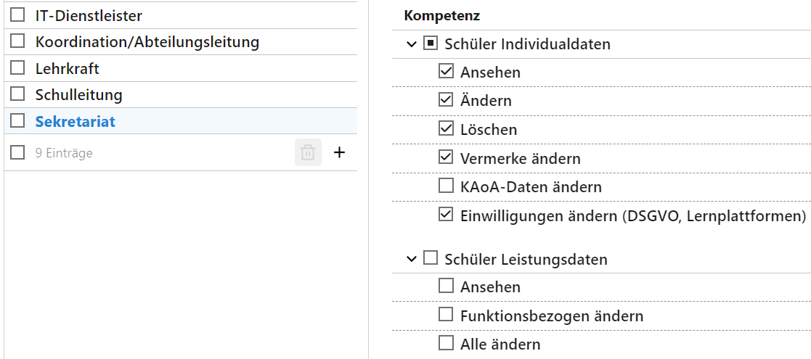

# Benutzergruppen

>![NOTE] Der SVWS-Server ist in der Entwicklung
>Der SVWS-Server befindet sich noch in der Entwicklung und das Rechtemanagement ist einer der Punkte, an denen dies besonders deutlich hervor tritt. Viele vorgesehene Rechteeinstellungen können hier auftauchen, obwohl die Funtkionen dahinter noch nicht implementiert sind.

## Einführung

Über für die an Ihrer Schule ausgefüllten Aufgaben passend definierte Benutzergruppen lassen sich die Zugriffsrechte der Benutzer steuern.

Grundsätzlich sollten alle Benutzer so viele Rechte erhalten, wie sie benötigen, aber nicht mehr.

An manchen Stellen erlauben die Rechte eine Unterscheidung, ob Daten nur angesehen oder auch geändert oder gelöscht werden können. Zum Beispiel sollten "Lehrer" die *Individualdaten* der Schüler ansehen, aber nicht ändern können. Die Änderung der Daten läuft unter Beachtung der geltenden Rechtslage über eventuelle *Abteilungsleitungen* beziehungsweise das *Sekretariat*.

Manche Lehrkräfte sind in der Verwaltung der *Sekundarstufe II* und dem *Abitur* eingebunden. Die Verwaltung der Lehrkräfte selbst obliegt eventuell der *Schulleitung* oder einer Schulverwaltungskraft.

Andere Rollen beziehen sich auf die Verwaltung der Datenbank und die Konfiguration der Schule oder von Leistungsdaten im Hintergrund. Zum Beispiel wären hier die diversen Kataloge wie die Unterrichtsfächer, das Erzeugen von Datenbank-Backups oder das Exportieren von Leistungsdaten über das Notenmodul zu nennnen.

Die Gruppe der **Administratoren** übernimnmt eine Sonderrolle: diese Gruppe verfügt über alle Kompetenzen und teilweise wird auch der Status des Administratoren-Benutzers abgefragt, zum Beispiel beim Login in den AdminClient.

Generieren Sie für Ihre Schule passende Benutzergruppen und beachten Sie, dass sich einem **Benutzer** auch noch individuell weitere Einzelrechte zuweisen lassen.

## Benutzergruppen definieren und verwenden

Die Verwaltung von Benutzergruppen besteht aus vier Bereichen:

1. Links in der Auswahlliste stehen alle definierten **Benutzergruppen**. Über das **+** unten rechts in der Liste lassen sich neue Gruppen anlegen.
2. Wurde eine Benutzergruppe ausgewählt, lassen sich die **Rechte** für diese Gruppe nach Kategorien und Einzelrechten sortiert vergeben. Ein Recht, das nicht vergeben ist, wird durch eine leere Checkbox ☐ dargestellt. Ein gebebenes Recht wird durch eine abgehackte Checkbox ☑ angezeigt. Dies gilt auch, wenn in einer Rechtegruppe alle Rechte zugeodnet sind. Sind in einer Rechtegruppe nicht alle Rechte gegeben, wird dies durch eine mit einem Punkt gefüllte Checkbox angezeigt (siehe Screenshot).
3. Im dritten Bereich sind **alle möglichen Benutzer** aufgeführt, dies beinhaltet alle in der Datenbank angelegten Benutzer. Fügen Sie einen Benutzer durch einen Klick auf ihn zur aktuell gewählten Gruppe hinzu.
4. Daneben finden sich **alle der gewählten Gruppe zugeordneten Benutzer**. Entfernen Sie diese mit einem Klick auf das Papierkorb-Symbol 🗑.

**Hinweise:** Ist eine Person in mehreren Benztzergruppen, erhält sie die Rechte von allen. Beachten Sie auch, dass einzelnen Benutzern in der Benutzerverwaltung noch zusätzliche Einzelrechte gegeben werden können.

## "Funktionsbezogene" Rechte

An einigen Stellen lassen sich Rechte "Funktionsbezogen" freigeben.

Dies bedeutet, dass die Rechte an eine Funktion gekoppelt sind, im Normalfall ist das etwa eine Klassenleitung oder Jahrgangsleitung inder Oberstufe, in anderen Fällen etwa eine Abteilungsleitung.

Demnach gelten diese Rechte beispielsweise nur in der zugewiesenen Klasse, aber nicht für alle anderen.

Die konkreten Details sind abhängig vom Kontext der jeweiligen Aufgabe der Rechte und der Funktion.

## Beispiele

Hier im 1. Beispiel ist die Benutzergruppe der Lehrkräfte zu sehen.

 ändern.")

Diese dürfen die Adressdaten und so weiter der Schüler nicht ändern, da dies mitunter offzielle Dokumente erfordert. Dafür aber die Leistungsdaten anzeigen lassen und - eventuell funktionsbezogen - ändern.

Auf der anderen Seite wäre es einer Benutzergruppe Sekretariat erlaubt, die Individualdaten zu ändern, aber die Leistungsdaten nicht einzusehen.

Dem Sekretariat ist hier auch das Anlegen und Ändern von Vermerken gestattet, die KAoA-Daten werden jedoch nicht vom Sekretariat gepfleft.