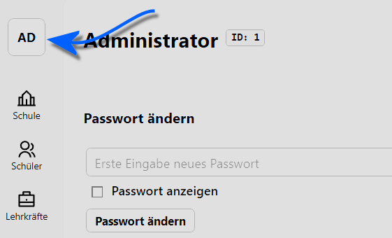

# Einstellungen

Über die Einstellungen erreichen Sie die Verwaltung für die **Benutzergruppen** und die **Benutzer**.

Bei den **Benutzergruppen** werden Rechte eingestellt, die Nutzer eines bestimmten Typs haben. Unter **Benutzer** werden dann konkreten Nutzern eine oder mehrere dieser Benutzergruppen zugewiesen und somit werden den Nutzern konkrete Rechte zugewiesen.

Je nach Skalierung Ihres Browserfensters finden Sie das Zahnrad-Symbol für die Einstellungen unten links oder oben rechts.

Die Seitenleiste mit den Apps ist links:

Die Seitenleiste mit den Apps ist oben:

Weiterhin finden Sie an diesen Stellen die Schaltflächen zum `Abmelden` und im die **Client-Info** mit der Versionsnummer und dem Lesbarkeitshinweis bezüglich der Geschlechterverwendung.

In der Client-Info findet sich auch ein Link auf das **Impressum**.

---

Beachten Sie an dieser Stelle auch die Möglichkeit, **Einstellungen für ihren aktuell angemeldeten Benutzer** vorzunehmen. Diese Einstellungen finden Sie immer oben links:

Die Details zu diesen Einstellungen finden Sie im Bereich der **App Aktueller Benutzer**.