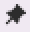

# Gymnasiale Oberstufe

In diesem Bereich wird die **App Oberstufe** besprochen.

Die Themen decken Vorbereitungen zu Laufbahnplanungen der neuen EF über die Wahlen bis hin Kurswahlen und zum Abitur ab. Nehmen Sie hier auch das Benutzerhandbuch zu WebLuPO zur Kenntnis, das in der Kopfzeile verlinkt ist. 

## Symbole
Diese Symbole finden sich in vielen der Menüs. Hinweise zu ihrer Bedeutung:

: Link zur individuellen Schülerlaufbahn.

: für Schüler liegt eine Fixierung vor.

: Schüler ist in angezeigten Kurs fixiert.

: Kurs ist fixiert.

: Kurs kann/ist für Schüler verboten.
