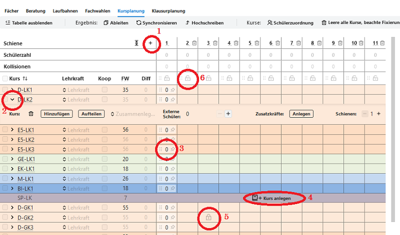

# Kursplanung 

## Blockungsübersicht

Zu jedem Abiturjahrgang kann in jedem Abschnitt eine oder mehrere Blockungen angelegt oder aus bestehenden Daten wieder hergestellt (restauriert) werden.
Wiederherstellung erfolgt dann, wenn die vorliegende Datenbank bereits importierte Blockungen enthält.

### Fall Wiederherstellung und Weiterbearbeitung
Wiederherstellung ist nur möglich, wenn in der Datenbank bereits Blockungsdaten vorliegen, z.B. nach einer Migration einer Schild2-Datenbank oder vergleichbarer Datenbestände.  
 
Nach Auswahl von Abiturjahrgang und Abschnitt **Wiederherstellen** aktivieren. Die Blockung wird dann als **Restaurierte** Blockung angezeigt. 
Angezeigt wird eine Übersicht über eingerichtete Kurse, in welchen Schienen sie liegen usw.

### Fall Neue Kursblockung

Über das **+**-Symbol wird eine neue Blockung erstellt.  
Es sollten dazu **vollständige Fachwahlen** für den gewählten Abschnitt vorliegen.  
Zum Ablauf der Einrichtung/Erstellung einer **neuen Blockung** siehe [Erstellen einer neuen Blockung](#erstellen-einer-neuen-blockung)

## Übersichten, Filter, Belegungsmatrix  

  

Die Blockungsübersicht zeigt die Lage der Kurse in den Schienen an, ebenso die Belegungszahl einer Schiene und die jeweilige Kursgröße.  
Im Falle einer **neu angelegten Blockung liegt noch keine Verteilung** vor.  

Durch Anklicken eines Kursnamens kann dieser in seiner Bezeichnung ergänzt, jedoch nicht vollständig umbenannt werden. So kann *BI-LK2* zu *BI-LK2-Koop* ergänzt werden.

Hinweis: sollte eine Kursgröße in diesem Format angegeben sein: 14|3, so befinden sich in diesem Kurs 14 Schüler der eigenen Schule und 3 einer Koopschule (Status Extern)  
**Weitere Funktionen** in dieser Übersicht werden unten stehend erläutert.  

### Schülerlisten (nach Filter)   
Rechts neben der Kursübersicht befinden sich **Schülerlisten**, deren Inhalt **gefiltert** werden kann:  

  

- **kein Filter**
- **Fachfilter**: Schüler mit einem bestimmten gewählten Fach und Kursart filtern. Beispiel: Alle mit **Fachwahl Deutsch LK**
- **Kursfilter**: Schüler eines gewählten Kurses filtern. Beispiel: Alle, die dem **Kurs D-LK1** zugewiesen sind.

Weiterhin kann auf diese Eigenschaften gefiltert werden:
- **K** **K**ollision: Schüler, die in der aktuellen Blockung eine Kurskollision haben, also zwei Kurse in einer Schiene.
- **NV** **N**icht **V**erteilt: Schüler, für die mindestens eine Fachwahl keinem Kurs zugewiesen ist.
- **K/NV**: Schüler mit Kollision und einer nicht verteilten Fachwahl. 

Die **Symbole** hinter den Namen stehen für das **Geschlecht** und die Eigenschaft **mündlich** oder **schriftlich** belegt.

## Umwahldialog  
Weiter rechts (ggf. nach rechts scrollen oder Container einklappen) befindet sich die Belegungsmatrix des ausgewählten Schülers.  
  
 
Hier können   
+ Kursbelegungen per **Drag&Drop** geändert werden  
+ Kurse durch **Verschieben** in die linke Fachwahlübersicht abgewählt werden.  
+ Schüler in Kursen **fixiert** werden (Setzen der Pinnadel)
 
Die **Kursart** (GKS, GKM, LK1, LK2, AB3, AB4 usw.) kann hier - im Gegensatz zu Kurs42 - **nicht geändert werden**.  
Dazu muss durch den Link links am Schülernamen in dessen Laufbahnplanung gewechselt werden.  
Nach Umwahl der Kursart kann vom Laufbahndialog wieder direkt in die Kursplanung gewechselt werden.  
[Laufbahnplanung](../../schueler/laufbahnplanung/index.md)

## Blockung berechnen
Um eine Blockung berechnen zu lassen, müssen zuvor
- Kurse eingerichtet werden  

und können zusätzlich  
- Fixierungen und Sperrungen von Kursen für bestimmte Schienen festgelegt werden  
- mögliche Schülerfixierungen in Kurse gesetzt werden  
- weitere Regeln (s.u.) gesetzt werden

Siehe dazu hier: [Erstellen einer neuen Blockung](#erstellen-einer-neuen-blockung)  

### Berechnungen durchführen

  

### Bewertungskriterien 

Im Berechnungsszenario werden die Ergebnisse mit vier Bewertungskriterien angegeben.  Durch Bewegung des Mauszeigers auf die Werte werden weitere Erklärungen dazu sichtbar (Fly-Over-Menü bzw. Tool-Tips).  
- Regelverletzungen (sollten 0 sein)
- Fachwahlkonflikte (sollten 0 sein)
- Kursdifferenzen (hängt von individuellen Bedingungen ab)
- Häufigkeit der Kursdifferenzen größer 0 (im Fly-Over-Tool-Tip werden die betroffenen Kurse angezeigt.)  

### Ableiten einer Blockung
Um ein vorliegendes Ergebnis einer Berechnung oder den Grundzustand der Blockungseinrichtung bestehen zu lassen und immer wieder darauf zurückgreifen zu können, kann durch **"Ableiten"** die Blockung dupliziert werden. Es können dann neue Regeln ergänzt oder bestehende gelöscht werden, um dann wieder neu zu berechnen.

## Blockung aktivieren

Durch Setzen des Hakens hinter eines der Blockungsergebnisse werden die weiteren Prozesse auf die jetzt aktivierte Blockung bezogen.  

Dazu gehören:  
* Abgleich mit den Fachwahlen
* Anzeigen der Kursbelegung der Schüler
* Kursbelegungslisten
* Rückführender Link aus der Schüler-Laufbahnplanung zurück in die aktivierte Blockung:  

## Erstellen einer neuen Blockung

### Grundeinstellungen der Blockung

  

**1**: **Hinzufügen** weiterer **Schienen**. Nicht benötigte Schienen können mit dem Papierkorb hinter der Schienennummer **gelöscht** werden.  

**2**: Untermenü für einen eingerichteten Kurs
+ **Papierkorb**: Löschen des Kurses
+ **Hinzufügen**: Kurs des Faches und der Kursart wird hinzugefügt
+ **Aufteilen**: Zunächst wie Hinzufügen. Befinden sich Schüler in dem Kurs, so wird ein weiterer Kurs mit identischem Fach und Kursart hinzugefügt und die Schüler des gewählten Kurses hälftig in beide Kurse verteilt.
+ **Zusammenlegen**: Es kann ein Kurs mit identischem Fach und Kursart gewählt werden, dessen Schüler werden dann in den ausgewählten Kurs übernommen, der dann leere Kurs wird unmittelbar gelöscht.
+ **Externe Schüler**: Durch **+** kann bereits die Zahl der zu erwartenden externen Schüler ergänzt werden. Dieser Wert wird dann bei den Kursdifferenzen berücksichtigt.
+ **Zusatzkräfte**  können ggf. eingetragen werden.
+ **Schienen**: Der Kurs kann auf weitere Schienen verteilt werden (z.B. bei "Huckepackkursen" oder besonderen Stundenplankonstellationen).  

**3**: Der Kurs kann per "Drag & Drop" in eine andere Schiene **verschoben** werden. Mit der Pinnnadel kann der Kurs in der Schiene **fixiert** werden (Nadel dann schwarz gefärbt).  

**4**: Der Kurs wird entgegen des Vorschlages doch **angelegt**.  

**5**: Durch Klicken in ein Feld wird diese Lage **für den einen Kurs gesperrt**.  

**6**: Die gesamte Schiene kann für **eine oder mehrere Kursarten gesperrt** werden.

**Hinweis:** Es ist häufig eine Frage des planerischen Geschickes (Übersicht, Reduktion von Rechenkapazität,...), ob Kurse eher in bestimmten Lagen fixiert, oder anders herum für bestimmte Lagen gesperrt werden.

### Kursauswahl

Durch Klicken auf die Teilnehmerzahl eines Kurses in der Schienenmatrix wird im Fach/Kursfilter neben der Schienenmatrix die Kursliste angezeigt.  
Für jeden Schüler wird daneben (je nach Bildschirmgröße nach rechts scrollen) der jeweilige Umwahldialog angezeigt.  
Es kann den jeweiligen Symbolen (s. Startseite Oberstufe) Eigenschaften der Schüler entnommen werden, wie  

+ Belegung schriftlich oder mündlich (Heft oder Sprechblase hinter Schülernamen)
+ Schüler im markierten Kurs fixiert (schwarze Pinnnadel vor Schülernamen)
+ Schüler in anderen Kursen fixiert (graue Pinnnadel vor Schülernamen)

### Fixierungen

Sowohl vor wie auch nach Berechnungen können Kurse in bestimmten Schienen fixiert werden. Ebenso können Schüler in bestimmten Kursen fixiert werden.  
Bei weiteren Berechnungen der Blockung bleiben diese Fixierungen dann erhalten.
Fixierungen können durch Anklicken der jeweiligen Pinnnadeln in der Schienenmatrix, der Kursliste im Fach/Kursfilter oder im Umwahldialog des einzelnen Schülers vorgenommen werden.

Darüberhinaus stehen unter **Fixiere alle Kurse** weitere Möglichkeiten zur Verfügung, bestimmte Schüler-Fixierungen zu setzen.  
So können im Falle einer neu anzulegenden Q2-Blockung in Grundkursen alle Schüler mit Fachwahl "3. Abiturfach" in ihrem bisherigen KUrs fixiert werden, um Lehrerwechsel zu vermeiden.  
Ebenso könnten nach einer Berechnung alle LKs in ihren Schienen fixiert werden, dann alle Schüler in den LKs fixiert werden. Danach können dann GK-Berechnungen durchgeführt werden, ohne, dass die Leistungskurse dabei noch berücksichtigt werden.

Werden einzelne **Kurse** zuvor durch einen Haken **ausgewählt**, so beschränken sich viele Fixierungsregeln nur auf diese Auswahl. Zu erkennen ist dies an der jetzt auftretenden Formulierung **"Kursauswahl"** vor diesen Regeln.

### Regeln

Unter **Regeln: Detailansicht** können neben den graphisch zu setzenden Bedingungen weitere Regeln für die Blockung erstellt werden. Hier sind zahlreiche Einstellungen möglich, wie z.B. 
+ Kurse auf eine bestimmte Größe zu begrenzen
+ Kurse mit anderen Kursen bedingen oder ausschließen
+ Bestimmte Schüler in bestimmten Kursen bedingen oder ausschließen
uvm.

Der Regelkatalog wird immer wieder an Nutzerwünsche angepasst, die Formulierungen der Regeln sind i.d.R. selbsterklärend.

Wurden alle Einstellungen gesetzt, kann die Blockung berechnet werden.  
Siehe [Berechnungen durchführen](#berechnungen-durchführen)

## Übertragung in Leistungsdaten

Der Übertrag der KUrse und Kursbelegungen ist nur im aktiven Abschnitt, nicht für vergangene Abschnitte möglich.  
Ausgelöst wird der Übertrag durch **Übertragen**.  
Es werden dadurch:
+ alle eingerichteten Kurse im Kurskatalog neu ein angelegt  
+ die Kurszuweisungen in die Leistungsdaten der Schüler eingetragen

### Änderungen durch Synchronisieren (nach einem Übertrag)    

Nach dem Übertrag ändert sich der Button **Übertrag** in **Synchronisieren**  
Synchronisation öffnet ein Hinweisfenster, dessen Text unbedingt gelesen werden sollte.

Die Synchronisation überträgt:  
+ Änderungen der Kurszugehörigkeit eines Schülers in dessen Leistungsdaten  
+ Kursartänderung eines vorhandenen Kurses
+ Lehrerwechsel eines Kurses  
+ Schienenwechsel eines Kurses  
+ neu eingerichteten Kurs in die Kurstabelle  

Die Synchronisation überträgt **nicht**  
+ für einen Schüler **neu gewählte Fächer**
+ die **Abwahl eines Faches**  
+ das **Löschen eines Kurses** (auch leere Kurse werden nicht gelöscht)  

Diese Eintragungen müssen eigenständig in der Kurstabelle oder den Schülerleistungsdaten vorgenommen werden.

**WICHTIG:** Sobald in den Leistungsdaten der Schüler Einträge vorgenommen werden, steht die Funktion "Synchronisieren" nicht mehr zur Verfügung.  
Es genügt dabei ein einziger Eintrag bei einem einzigen Schüler. Leistungsdaten sind dabei:  
+ Quartalsnoten, Zeugnisnoten  
+ Noten für Teilleistungen  
+ Fehlstunden (FSG, FSU)  

## Beispiele und Praxistipps

### Weiterblocken mit veränderten Regeln

Nach einer Berechnung können die Regeln nicht mehr geändert werden.  
Zum Ändern/Ergänzen von Regeln muss die **Blockung abgeleitet** werden oder alle **Blockungsergebnisse bis auf eines gelöscht** werden.

Im folgenden Beispiel werden **zunächst die Leistungskurse** und **anschließend die Grundkurse** geblockt.  
 

### LK-Blockung

Es sind einige erkennbare und nicht erkennbare Regeln und Fixierungen enthalten.:  

  

+ Einige **LKs** wurden in Schienen **fixiert** (schwarze Pinnnadeln).  

+ Die Schienen 3 bis 11 wurden für **Leistunskurse gesperrt** (graue Felder bei LKs).  

+ Die Schienen 1 und 2 wurden für **GKs und ZKs gesperrt** (graue Felder bei GKs, i.d.R. redundant durch LK-Setzung in Schienen 1 und 2).   

+ Die Kurse SP-LK1 und BI-LK2 sind **Koop-Kurse** (Unterricht an anderer Schule, Haken bei Koop gesetzt).  

+ Der Kurs BI-LK2 wurde auf **maximal zwei Schüler** begrenzt. Diese zwei Schüler belegen gleichzeitig M-LK1, daher sollen **nur diese beiden** in BI-LK2 (Diese Regel ist nur unter **Regeln Detailansicht** sichtbar).  

+ Die LKs D und E haben zunächst keine Vorgaben.  

Einmaliges schnelles Blocken liefert evtl. noch Kollisionen, eine weitere Blockungsberechnung liefert in diesem Beispiel aber u.a. dieses Ergebnis:

 

Hier kann jetzt ein Ergebnis ausgewählt werden:

Ebenso können definitiv unbrauchbare Ergbnisse gelöscht werden. Wird der Haken direkt bei **ID** gesetzt, werden alle Ergebnisse markiert.  
Der Haken der Wunschergebnisses (und evtl. die Startvorlage) kann entfernt werden. Dann können alle anderen Ergbnisse auf einmal gelöscht werden.

**Hinweis:** Änderungen der Regeln sind nicht mehr möglich, solange mehrere Ergebnisse vorliegen. Es können jetzt nur Kurse-Schienen- oder Kurs-Schüler-Zuordnungen geändert werden.  
Zum **Ändern von Regeln** für neue Berechnungen darf entweder **nur ein Ergebnis stehen bleiben** oder die **Blockung muss abgeleitet werden**. Letzteres hat den Vorteil, dass auf die bisherigen Ergbnisse immer wieder zurückgegriffen werden kann.

### GK-Blockung

Um nur noch die GKs zu blocken werden erst alle **LKs in ihren Lagen fixiert**, dann alle **Schüler in den LKs fixiert**.  
(Anmerkung: Evtl. kommt in späteren Versionen die Option hinzu, bestimmte Kurse beim Blocken gar nicht erst zu berücksichtigen.)  

#### Zusatzbeispiel: Spezialfall Sportprofile

Es kann (nicht nur in Sport) vorkommen, dass bereits vor dem Blocken ein Kurs eines Faches eine bestimmte Schülergruppe enthalten muss.  
Hier kann die Funktion **Kurse: Schülerzuordnung** eingesetzt werden.  

1. **Leeren des Fußball-Kurses** SP-GK1-FB  

2. **Zuweisung** Schüler in SP-GK1-FB  
  

Ergänzend können die hier schon **Schüler in Ziel-Kursen fixiert** werden. 

3. **Vorgang** für die anderen drei Sportkurse entsprechend **wiederholen**.  

4. Sport-GKs auswählen (Haken setzen) und **Schülermenge fixieren**. 

5. Falls alle oder einige dieser Kurse z.B. nachmittags stattfinden, können zusätzlich diese **Kurse noch in bestimmten Schienen fixiert** werden.

#### Zusatzbeispiel Kerngruppen/Parallelkurse

Hier wird dargestellt, wie z.B. in einer **EF feste Gruppen für D, M und E-Kurse** gebildet werden. D.h. die Schülergruppe hat die Fächer D, M und E immer gemeinsam, ggf. kann auch Sport dazu ergänzt werden.  

Über **Kurse: Schülerzuordnung** kann eine feste Schülergruppe mehreren Kursen zugewiesen (und dort fixiert) werden.  
Dazu werden die Schüler erst einem Kurs (hier D-GK1) zugeordnet, dann werden weitere Kurse ausgewählt.  

  

## Schüler individuell bearbeiten

### Kurs: Schülerzuordnung

*in Bearbeitung, ab Dezember 2024*  

### Blockungsmatrix

*in Bearbeitung*

