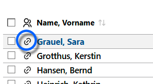

# Laufbahnen

  

Es wird die Schülerliste angezeigt, in der Regel sind anfangs alle Laufbahnen noch unvollständig und daher **mit Fehlern**.

Später kann durch die Schieberegeler gewählt werden, welche Schülermenge angezeigt werden soll.  

+ **alle** Schüler anzeigt werden. Dies ist der Status, wenn alle Regler ausgeschaltet sind.
+ **Nur Fehler** zeigt nur die Wahlen mit Laufbahnfehlern
+ Über **Externe ausblenden** werden externe Schüler ausgeblendet, die zwar in der Datenbank als Schüler des Jahrgangs erfasst sind, für die aber an dieser Schule keine Laufbahnwahlen verwaltet werden.
* Der Schalter **Nur mit Fachwahlen** zeigt nur Schüler, die auch gewählt haben. Hierüber lassen sich etwa Schüler der kommenden EF ausblenden, die aber nicht in die EF wechseln.
* Über **Neuaufnamen** werden auch neue Schüler angezeigt, die noch nicht den Status **aktiv** haben - zum Beispiel Schüler die für die kommende EF aufgenommen wurden. 

Jede Schülerlaufbahnwahl kann direkt intern im SVWS-Client oder extern per WebLuPO durchgeführt werden. Nach dem Einlesen der Wahlen lassen sich dieser im SVWS-Client vollständig weiter verwalten.

Im Client gelangt man über das Linksymbol 🔗 **Zur Laufbahnplanung** in die individuelle Laufbahnplanung des jeweiligen Schülers.  

## Export in WebLuPO

Für die Verwendung von WebLuPO können durch **Exportieren alle** für die ganze Stufe die individuellen Laufbahndateien exportiert werden.  

Die Durchführung der Fachwahlen ist in WebLuPO beschrieben und analog zur Fachwahl in der internen individuellen Laufbahnplanung.

## Import aus WebLuPO

Durch **Importieren** werden die bearbeiteten Laufbahndateien der Schüler wieder eingespielt.  
In der vorliegenden Maske werden wie oben beschrieben aber nur die **Fehler in den Fachwahlen angezeigt, nicht hingegen die Fachwahlen selber**.  
Zur Bearbeitung der Fachwahlen muss wieder in die interne Laufbahnplanung (**Zur Laufbahnplanung**) des Schülers gewechselt werden.

## Import aus LuPO

Wurden Laufbahnwahlen mit dem alten Programm eigenständigen Programm *LuPO* vorgenommen, etwa wenn Sie noch SchILD-NRW 2 nutzen, lassen sich diese Laufbahnen auch in den SVWS-Server importieren.

Gehen Sie hierzu über die **App Schule**. Dort können Sie unter **Datenaustausch ➜ LuPO Laufbahnplanung** den Import durchführen. Hierbei ist die Lehrerdatei `.lup`anzuwählen.

>[!IMPORTANT] Fächer passend einstellen, eventuell "Datei komprimieren" und Dateiendungen
>Achten Sie darauf, dass in LuPO und dem SVWS-Server die Fächer - "Fächer der Oberstufe" - korrekt und gleich eingestellt sind.
>Wenn Sie einen Fehler bekommen, dass die Datei nicht eingelesen kann, probieren Sie in LuPO die Funktion **Datei ➜ Datei komprimieren** aufzurufen.
> Beachten Sie: Die Schülerdateien ´.lpo´ werden vom SVWS-Server *nicht* verarbeitet, er liest zum Import die Lehrerdatei ´.lup´ ein. WebLuPO-Dateien enden auf ´.lp´.

## Nachträglich aufgenommene Schüler  

Werden Schüler erst im Laufe der Oberstufe nachträglich in eine Jahrgangsstufe aufgenommen, so sind

+ in SchILD-NRW die Lernabschnitte ab EF.1 zu ergänzen
+ in der Laufbahnplanung die vergangenen Abschnitte zu ergänzen
