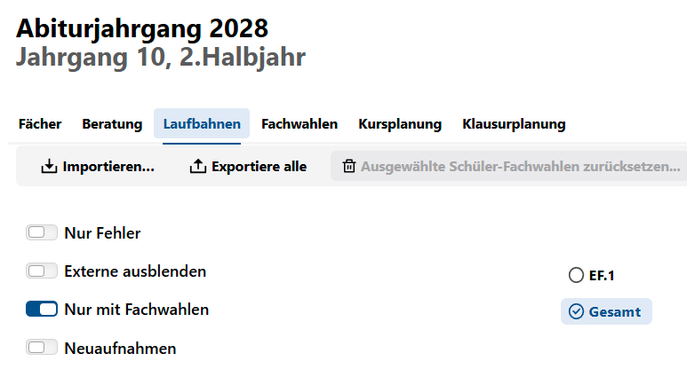

# Laufbahnen

  

Es wird die Schülerliste angezeigt, i.d.R. sind anfangs alle Laufbahnen noch unvollständig und daher **mit Fehlern**.
Später kann durch den Schieberegeler gewählt werden, ob  

+ **alle** Schüler
+ nur welche **mit Laufbahnfehlern**
+ zusätzlich auch **Externe** (Koop-)Schüler  

angezeigt werden sollen.  

Jede Schülerlaufbahnwahl kann direkt in svws-Client (interne Bearbeitung) oder per WebLuPO (externe Bearbeitung) durchgeführt werden.  

Intern gelangt man per **Zur Laufbahnplanung** in die individuelle Laufbahnplanung des jeweiligen Schülers.  

## Export in WebLuPO

Für die Verwendung von WebLuPO können durch **Exportieren alle** für die ganze Stufe die individuellen Laufbahndateien exportiert werden.  

Die Durchführung der Fachwahlen ist in WebLuPO beschrieben und analog zur Fachwahl in der internen individuellen Laufbahnplanung.

## Import aus WebLuPO

Durch **Importieren** werden die bearbeiteten Laufbahndateien der Schüler wieder eingespielt.  
In der vorliegenden Maske werden wie oben beschrieben aber nur die **Fehler in den Fachwahlen angezeigt, nicht hingegen die Fachwahlen selber**.  
Zur Bearbeitung der Fachwahlen muss wieder in die interne Laufbahnplanung (**Zur Laufbahnplanung**) des Schülers gewechselt werden.

## Import aus LuPO

Wurden Laufbahnwahlen mit dem alten Programm eigenständigen Programm *LuPO* vorgenommen, etwa wenn Sie noch SchILD-NRW 2 nutzen, lassen sich diese Laufbahnen auch in den SVWS-Server importieren.

Gehen Sie hierzu über die **App Schule**. Dort können Sie unter **Datenaustausch ➜ LuPO Laufbahnplanung** den Import durchführen. Hierbei ist die Lehrerdatei `.lup`anzuwählen.

>[!IMPORTANT] Fächer passend einstellen, eventuell "Datei komprimieren" und Dateiendungen
>Achten Sie darauf, dass in LuPO und dem SVWS-Server die Fächer - "Fächer der Oberstufe" - korrekt und gleich eingestellt sind.
>Wenn Sie einen Fehler bekommen, dass die Datei nicht eingelesen kann, probieren Sie in LuPO die Funktion **Datei ➜ Datei komprimieren** aufzurufen.
> Beachten Sie: Die Schülerdateien ´.lpo´ werden vom SVWS-Server *nicht* verarbeitet, er liest zum Import die Lehrerdatei ´.lup´ ein. WebLuPO-Dateien enden auf ´.lp´.

## Nachträglich aufgenommene Schüler  

Werden Schüler erst im Laufe der Oberstufe nachträglich in eine Jahrgangsstufe aufgenommen, so sind

+ in SchILD-NRW die Lernabschnitte ab EF.1 zu ergänzen
+ in der Laufbahnplanung die vergangenen Abschnitte zu ergänzen
