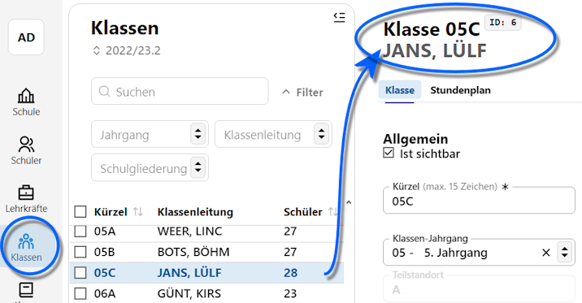
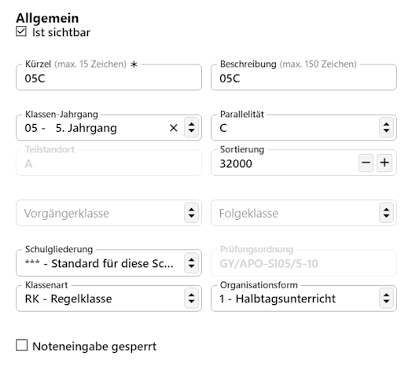
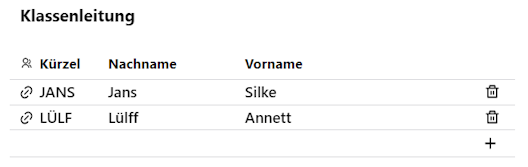
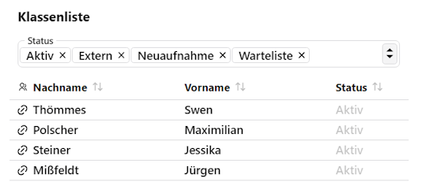

# Klassen

Über die **App Klassen** werden die an Ihrer Schule eingerichteten Klassen verwaltet.

## Suchen, Filtern und die Auswahlliste

Direkt oberhalb der Auswahlliste finden sich Felder zum **Suchen** nach einer freien Eingabe oder filtern. Im Filterbereich stehen Auswahlfelder für den **Jahrgang**, nach **Klassenleitung** oder der **Stufengliederung** - an vielen Schulen sind dies die Abteilungen - zur Verfügung.

Es öffnet sich nach Auswahl einer Klasse in der Auswahlliste, hier wurde die 05C gewählt, zuerst der Tab **Klassen** mit den Details. Es wird die Klasse mit der Klassenleitung angezeigt.

## Klassendetails

Zuoberst lässt sich über einen Haken anwählen, ob die Klasse als **Ist sichtbar** markiert ist. Diese Einstellung steuert mit dem Haken **✓**, ob die Klasse in Dropdown-Menüs zur Auswahl steht oder nicht. Haben Sie zum Beispiel eine 1D angelegt, sind im neuen Schuljahr aber nur dreizügig, kann die alte Klasse gelöscht werden und ist dann weg oder sie wird auf "nicht sichtbar" gestellt und kann dann bei Bedarf einfach wieder aktiviert werden.

Als **Kürzel** und **Beschreibung** können Sie freie Bezeichner wählen, ob die Klassen an Ihrer Schule die 8.1, 8.2 und so weiter oder die 8A, 8B und so weiter oder die "Igelklasse" oder die "Bieberklasse" sind, steht Ihnen frei.

Im **Klassenjahrgang** werden Jahrgänge immer zweistellig ausgewiesen. Unter der **Parallelität** ist immer A, B, C und so weiter zu wählen. Hieraus werden die eindeutigen Bezeichner für die amtliche Schulstatistik erzeugt, nach der Klassen immer aus diesem Jahrgang und der Parallelität bestehn.

::: tip Beispiel
Aus der 5.1 würde also für die amtliche Schulstatistik die 05A. Hier würden Sie die "Igelklasse" zur 03B oder Vergleichbares machen.  
:::

Hat die Schule mehrere Standorte, werden diese über **Teilstandort** alphabetisch durchgezählt und hier würde angegeben, an welchem Standort die Klasse primär verortet ist.

Über die **Sortierung** lässt sich im Klassenkatalog manuell einstellen, in welcher Reihenfolge die Klassen anzeigt werden. Automatisch werden Klassen nach Jahrgängen sortiert, aber an Grundschulen mit anders benannten Klassen oder an Berufskollegs mit einer komplexeren Struktur sind hier durch Benutzer festgelegte Sortieren möglichen.

Weiterhin werden unter **Schulgliederung** und **Prüfungsordnung** eventuell geltende Daten eingestellt. Im Normalfall gilt **\*\*\* - Standard für diese Schulform**. Als Gliederungen sind für die Schule eingestellte Gliederungen wählbarm an Gynmasien wäre den das beispielsweise G8, G9 oder ob es sich um ein Aufbaugymnasium handelt. 

Über **Klassenart** lässt diese einstellen, hierbei sind die gültigen Rechtsvorschriften zu Rate zu ziehen. Der Standard ist *Regelklasse*.

Gleiches gilt für die **Organisationsform**. Üblicherweise werden hier die Einstellungen zum Halbtag, Ganztag (offen, gebunden, erweitert) und so weiter vorgenommen. 

Wird über den SVWS-Client oder andere externe Programme die **Noteneingabe** verwaltet, lassen sich Klassen einzeln für die Noteneingabe sperren oder freigeben.

Die Rechte für die Einstellungen hier lassen sich über die Rechteverwaltung der konkreten Benutzer und Benutzergruppen steuern.

## Klassenleitung

Über **Klassenleitung** können Sie Lehrkräfte zur Klassenleitung auswählen.

Entfernen Sie Lehrkräfte über den Mülleimer **🗑** oder fügen Sie neue Lehrkräfte über das Plus **+** hinzu. 

In der Liste lassen sich mehrere Lehrkräfte hinzufügen und eine hierarchisierung nach "Klassenleitung" und "Stellvertretende Klassenleitung" findet nicht statt.

::tip Linksymbol
Über das *Linksymbol 🔗* links vom Kürzel springen Sie direkt in den Datensatz dieser Lehrkraft.
:::

## Klassenliste

Rechts der Details findet sich die Auswahliste mit den Schülern (m/w/d), die dieser Klasse zugeordnet sind.

Über **Status** kann gefilert werden, ob alle Schüler angezeigt werden sollen. Möglich wäre es hier, nur die Externen oder gerade nicht die Externen Schüler anzeigen oder erst noch neu hinzukommende Schüler aus der Neuaufnahme auszunehmen.

::: tip Link
Beachten Sie hier auch das Linksymbol 🔗, mit dem zu dem betreffenden Personendatensatz gesprungen werden kann.
:::
