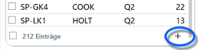
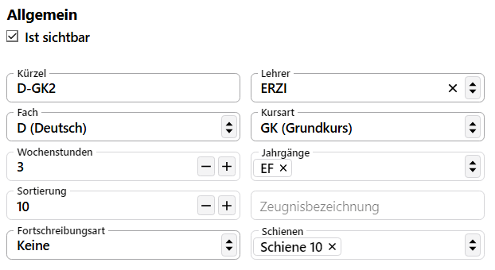
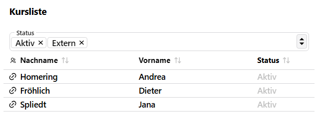

# Kurse

In der **App Kurse** werden die Kurse der Schule verwaltet, die dann den Schülern in den Liestungsdaten der Lernabschnitte zugewiesen werden können.

::: warning Blockung in der App Oberstufe
Hierbei ist zu beachten, dass die Blockungsmechaniken in der **App Oberstufe** ebenfalls in der Lage sind, im Zuge der Blockung erzeugte Kurse anzulegen, ohne dass diese hier in der App Kurse erzeugt werden müssen.

Kurse lassen sich ebenfalls aus externen Programmen importieren.
:::

## Auswahlliste

Oben über der Auswahlliste der Kurse stehen Optionen zum **suchen** und **filtern** zur Verfügung. Über das Suchfeld sind freie Eingaben möglich, über den die diversen Filter lässt sich auf einzelne **Schüler**, **Fächer**, **Lehrkräfte**, **Jahrgang** und die **Schulgliederung** suchen.

:::tip Mehrfachauswahlen
In den Filterbereichen sind *Mehrfachauswahlen* möglich.
:::

Die komplette Liste lässt sich über den Schalter **Nur sichtbare** auf die Kurse filtern, die den Haken bei **Ist sichtbar** in den Details gesetzt haben.

Hiermit lassen sich Kurse, die man gerade nicht braucht, aber auch nicht permanent löschen möchte, aus allen Auswahllisten ausblenden.

Über die **Checkboxen ☐** auf der linken Seite bei den Einträgen lassen sich mehrere oder auch alle Kurse auswählen, um Operationen über diese Auswahl durchzuführen. Wird eine Auswahl **☑** getroffen, schaltet der Client automatisch in den Modus für Gruppenprozesse.

Ganz oben unter der Überschrift **Kurse** lässt sich der zu **bearbeitende Lernabschnitt** wählen.

## Neue Kurse hinzufügen und Kurse bearbeiten

### Kurs anlegen

Neue Kurse werden mit einem Klick auf das Plus **+** am Ende der Auswahlliste erzeugt.

### Kurs bearbeiten

Existierende Kurse können im Bereich rechts bearbeitet werden.

Über den Haken bei **Ist sichtbar** ☑ lässt sich steuern, ob der Kurs in der Auswahlliste und an anderen Stellen im SVWS-Client angezeigt werden soll. Dieser Haken wird genutzt, wenn man einen Kurs nicht dauerhaft löschen, sondern nur aktuell nicht nutzen möchte.

Das Feld für **Kürzel** ist frei wählbar, hier sollten jedoch keine allzulangen Bezeichner gewählt werden, da die Spaklten in Übersichtslisten nicht von langen Kürzeln ausgehen.

Weiter unten rechts findet sich die **Zeugnisbezeichnung** wo eine vom Fach abweichende, freie Bezeichnung eingegeben werden kann, die dann auf dem Zeugnis ausgeben wird. Diese Bezeichnung wird im Standardfall einfach frei gelassen.

Bei **Lehrer** und **Fach** werden Einträge aus den jeweiligen Katalogen gewählt.

Die **Kursart** folgt aus der jeweiligen Prüfungsordnung.

Die **Wochenstunden** sind entsprechend der Planung in der Schule zu setzen und über die Auswahllisten bei **Jahrgänge** lassen sich einer oder mehrer Jahrgänge anhaken, für die dieser Kurs gilt.

Über die **Fortschreibungsart** wird gesteuert, wie sich der Kurs beim Schuljahreswechsel verhält:
+ *keine* - das Schuljahr wird gewechselt, der Kurs wird nicht im neuen Lernabschnitt angelegt.
+ *Nur Definition, Jahrgang hochschreiben* - der Kurs wird ohne Schüler ins neue Schuljahr übernommen, der Jahrgang wird einen Jahrgang hochgeschrieben.
+ *Nur Definition, Jahrgang wird beibehalten* - der Kurs findet sich genauso wie jetzt im neuen Schuljahr wieder, nur ohne die Schüler.
+ *Komplett* - der Kurs wird im neuen Lernabschnitt mit den erhöhten Jahrgang und den Schülern wieder angelegt.

::: tip Beispiel
Wählen Sie die Fortschreibungsart so, wie es in der Organisationsstruktur Ihrer Schule Sinn macht. AGn oder Kurse, die einen Jahrgang in ihrer Bezeichnung haben, werden nicht in einen Folgejahrgang hochgeschrieben.
:::

Wenn im SVWS-Client eine Blockung hinterlegt ist beziehungsweise eine erstellt wird, sind die Kurse in parallelen **Schienen** angeordnet. Diese Schienen werden auch in der Kursansicht angezeigt und lassen sich ändern. Das Ändern von Schienen ist nur wohlüberlegt durchzuführen.

## Die Schüler-Kursliste

Rechts von den Details werden die zu diesem Kurs zugeordneten Schüler angezeigt.

Über den Filter **Status** lassen sich Schüler mit anderen Stati ein- und ausblenden. Per Standard werden nur Schüler angezeigt, die entweder *aktiv* sind oder als *extern*e Schüler am Kurs teilnehmen. Zum Beispiel lassen sich auch Schüler anzeigen, die *beurlaubt*, in der *Neuaufnahme* sind oder einen anderen Status haben. 

::: tip Beispiel
Beachten Sie an dieser Stelle das Linksymbol 🔗, mit dem man direkt zu einem Schülerdatensatz springen kann.

Von dort kann man mit dem `Zurück`-Knopf des Browsers wieder zur Kursansicht zurückkehren.
:::

