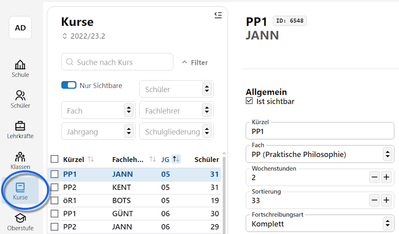

# Kurse

In der **App Kurse** werden die Kurse der Schule verwaltet, die dann den Schülern in den Liestungsdaten der Lernabschnitte zugewiesen werden können.

::: warning Blockung in der App Oberstufe
Hierbei ist zu beachten, dass die Blockungsmechaniken in der **App Oberstufe** ebenfalls in der Lage sind, im Zuge der Blockung erzeugte Kurse anzulegen, ohne dass diese hier in der App Kurse erzeugt werden müssen.

Kurse lassen sich ebenfalls aus externen Programmen importieren.
:::

## Auswahlliste

Oben über der Auswahlliste der Kurse stehen Optionen zum **suchen** und **filtern** zur Verfügung. Über das Suchfeld sind freie Eingaben möglich, über den die diversen Filter lässt sich auf einzelne **Schüler**, **Fächer**, **Lehrkräfte**, **Jahrgang** und die **Schulgliederung** suchen.

:::tip Mehrfachauswahlen
In den Filterbereichen sind *Mehrfachauswahlen* möglich.
:::

Die komplette Liste lässt sich über den Schalter **Nur sichtbare** auf die Kurse filtern, die den Haken bei **Ist sichtbar** in den Details gesetzt haben.

Hiermit lassen sich Kurse, die man gerade nicht braucht, aber auch nicht permanent löschen möchte, aus allen Auswahllisten ausblenden.

Über die **Checkboxen ☐** auf der linken Seite bei den Einträgen lassen sich mehrere oder auch alle Kurse auswählen, um Operationen über diese Auswahl durchzuführen. Wird eine Auswahl **☑** getroffen, schaltet der Client automatisch in den Modus für Gruppenprozesse.

Ganz oben unter der Überschrift **Kurse** lässt sich der zu **bearbeitende Lernabschnitt** wählen.

## Neue Kurse hinzufügen

## Kurse bearbeiten

### Kursbezeichnung ändern 

### Kuslehrer ändern

### Schüler aus Kurs entfernen oder hinzufügen

