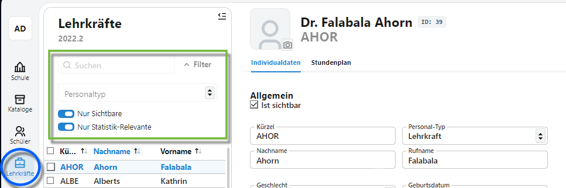
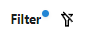

# Lehrkräfte

Über den Bereich **Lehrkräfte** lassen sich eben diese Lehrkräfte, aber auch weitere Personen erfassen, die an Ihrer Schule eine Rolle spielen, wie etwa das Sekretariat, Sozialarbeiter und so weiter.

Die Liste der Lehrkräfte ist analog zu den Schülern aufgebaut. Auf der **linken Seite** lassen sich die in der Datenbank hinterlegten Personen filtern.

Diese Filter stehen zur Verfügung:
* Über das **Suchfeld** lassen sich beliebige Zeichenfolgen im Vor- und Nachnamen finden.
* Über den **Personaltyp** stehen über das Dropdown-Menü folgen Personalarten zur Auswahl:
  * *Lehrkraft*
  * *Sekretariat*
  * *Angestelltes Personal ohne Identnummer*
  * *Externe Lehrkraft, z.B. abgeordnet oder im Rahmen einer Kooperation*
  * *Stonstiges Personal*

Über die nächsten beiden Schalter werden **Nur Sichtbare** oder **Nur Statistik-Relevante** Personen angezeigt. 

Über den ersten Schalter lassen sich etwa ehemalige Lehrkräfte aus der Liste ausblenden, die jedoch noch in der Datenbank erfasst sind, da sie in den den Leistungsdaten vergangener Lernabschnitte noch vorkommen.

Über den zweiten Schalter können Personen ein- und ausgeblendet werden, die als Personal erfasst sind, aber nicht für die Statistik heranzuziehen sind.

Ein blauer Punkt macht kenntlich, dass ein Filter aktiv ist:

Ein Klick auf den Filtertrichter setzt die Filter zurück. 

Wurde eine Person angewählt, sind auf der rechten Seite die Details über diverse Tabs etwa zu Stammdaten, Einsätzen und so weiter zu erfassen.
