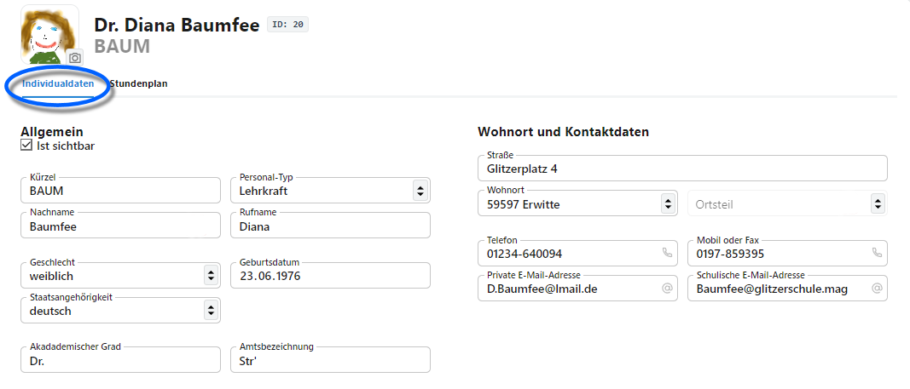
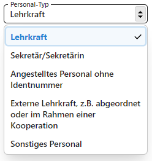

# Individualdaten

In den Individualdaten lassen sich die Personaldaten der Lehrkräfte erfassen. 

Es lässt sich hier auch ein Haken setzen, ob der Datensatz bei der späteren Arbeit **sichtbar** sein soll. Schalten Sie zum Beispiel ehemalige Lehrkräfte, die wegen ihres Vorkommens in alten Leistungsdaten noch in der Datenbank erhalten sind, auf nicht sichtbar.

Das **Foto** lässt sich hochladen, wenn Sie mit der Maus über den Fotobereich fahren. Weiterhin lässt sich auch direkt ein Foto aufnehmen, wenn eine Kamera an den Rechner angeschlossen ist. Eventuall fragt der Browser nach einer Berechtigung, auf die Kamera zuzugreifen.

Neben Kürzel, Vornamen und Nachname, einem eventuelle akademischen Grad und anderen Personaldaten werden ebenfalls die Wohnort- und Kontaktdaten erfasst. 

Über den **Personal-Typ** steht eine Dropdown-Liste zur Verfügung für unterschiedliche Typen. 

Es lassen sich von "regularären" Lehrkräften bis zu "Sonstiges Personal" alle an der Schule beschäftigten Personengruppen erfassen.

Wichtig ist bei Lehrkräften darauf zu achten, ob sie **statistikrelevant** sind.