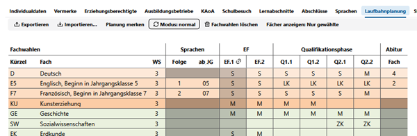
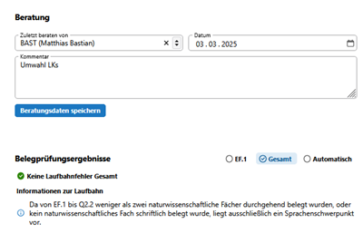

# Laufbahnplanung



Gibt es für einen Schüler oder Schülerin schon eine Laufbahnplanung für die gymnasiale Oberstufe, wird diese im Untertab **Laufbahnplanung** angezeigt.  
 
**Neuaufgenommene Schüler**:  
Für nachträglich aufgenommene Schüler ist die Laufbahnplanung vollständig auch für vergangene Abschnitte zu ergänzen. Hierfür sind die jeweiligen Lernabschnitte zuvor anzulegen (in Schild).  
    


In der Oberfläche lassen sich auch alle Änderungen zur Laufbahnplanung durchführen, ebenso lassen sich Beratungsdaten und Beratungsbemerkungen setzen.

Die Planung lässt sich als LuPO-Datei ````lp```` exportieren und importieren.

Um Alternativen auszuprobieren, kann mittels ````Planung merken```` die aktuelle Planung gespeichert werden. Eventuelle temporäre Änderungen werden dann im Anschluss mit einem Klick auf ````Planung wiederherstellen```` rückgängig machen. Sollen diese temporären Änderungen übernommen werden, können sie nun dauerhaft eingestellt werden.

Modus:
* Normal
* Hochschreiben
* Manuell
  

Die **graue Schraffierung** im der Abbidung oben der EF.1 bedeutet, dass für den angezeigten Schüler bereits Leistungsdaten für den Abschnitt hinterlegt sind. Hier ist demnach keine Änderung in der Laufbahnplanung mehr möglich.  
Dennoch notwendige Änderungen müssen dann erst in den Leistungsdaten getätigt werden. (Fach/Kurs löschen, Kursart oder Kurs ändern).  
Der **Link hinter EF.1** zeigt an, dass ein Kursplanung für den Abschnitt vorliegt und verweist auf diesen.  
Hinweis: Es ist möglich, dass Leistungsdaten ohne Kursplanung vorliegt, aber auch, dass eine Kursplanung ohne Leistungsdaten vorliegt.


Mit ````Fächer anzeigen```` kann zwischen *alle* und *nur gewählte* umgeschaltet werden, so dass Zeilen mit nicht gewählten Fächern ausgeblendet werden. 

Im rechts nebenstehenden Bereich werden ggf. **Kommentare** hinterlassen und **Laufbahnfehler** entsprechend der Einstellungen angezeigt.
