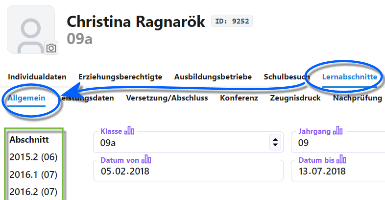
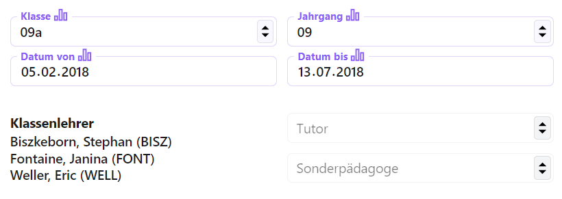
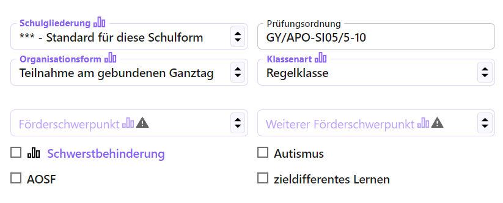
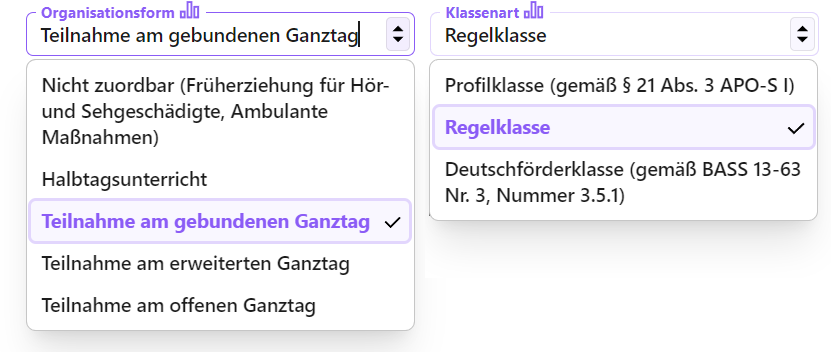

# Lernabschnitte - Allgemein

Unter den allgemeinen Daten der Lernabschnitte finden sich auf der linken Seite in der *Auswahlliste* die Übersicht über alle für diesen Schüler angelegten Lernabschnitte.

## Wahl eines Halbjahres

Wählt man hier einen Lernabschnitt - ein spezifisches *Halbjahr* - werden die Daten für diesen angezeigt.

Einige der Daten werden automatisch aus anderen Daten in der Datenbank ausgefüllt, andere sind einzutragen. Im Screenshot wurde der Lernabschnitt der Klasse 9 gewählt.

Wird hier zum Beispiel die Klasse *09a* gewählt, werden die Daten für die **Klassenleitung** automatisch übernommen.

Weiterhin ist der **Jahrgang** einzutragen, wie auch **Beginn** und Ende des **Lernabschnitts**.

Beachten Sie hier, dass viele der Einträge *statistikrelevant* sind.

Weitere Daten sind die **Schulgliederung** oder die **Organisationsform** mit etwa der Teilnahme am Ganztag.

Das Feld mit der **Prüfungsordnung** ist nicht statistikrelevant, wird aber für viele automatische Prüfungen wie Versetzungs- und Abschlussprüfungen abgerufen.

Bei der Gliederung und Organisationsform lassen sich die Werte abrufen, die für die Schule zentral erfasst wurden. Tragen Sie ebenfalls die **Klassenart** ein.

In der Organsiationsform etwa sind die unterschiedlichen Ganz- und Halbtagsoptionen auswählbar. Bei der Klassenart eine Profilklasse, der Standardfall der Regelklasse oder eine dediziert ausgewiesene Deutschförderklasse.

Die **Förderschwerpunkte** dürfen leer bleiben. Schauen Sie in die Schlüsseltabellen und Eintragungshilfen von IT.NRW zur amtlichen Schulstatistik, welche Förderschwerpunkte in welcher Kombination der beiden Felder zulässig sind.

Über die Checkboxen lassen sich die statistikrelevante **Schwerbehinderung**, die **Autismus**-Diagnose, **ASOF** und **zieldifferentes Lernen** in diesem Lernabschnitt erfassen.