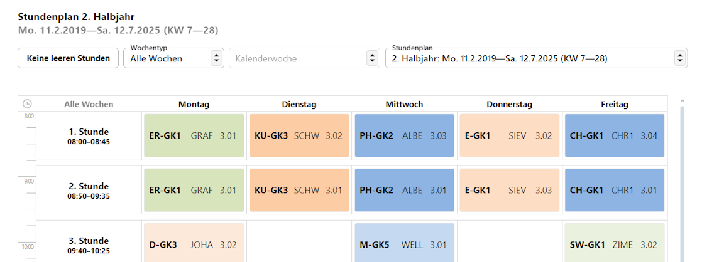

# Stundenplan 

Wurde ein **Stundenplan** für eine Person hinterlegt, wird dieser hier nun angezeigt.

::: info Schüleransicht ist nur-lesen
Der Stundenplan lässt sich in dieser Ansicht nicht bearbeiten.
:::

Oben rechts lässt sich unter **Stundenplan** auswählen, welcher von mehreren Stundenplänen gelten soll. Direkt oben links im Kopf steht dann, für welchen Zeitraum dieser Stundenplan gültig ist.

Über **Keine leeren Stunden** werden eventuell leere Stundenzeilen ausgeblendet.

Über den Auswahlbereich **Wochentyp** lassen sich der Wochentyp wählen, wenn die Stundenpläne wöchentlich wechseln. Typisch sind Stundenpläne, die nicht wechseln oder in zwei A- und B-Wochen eingeteilt sind. Der SVWS-Client unterstützt jedoch beliebige Wochentypen.

Weiterhin lässt sich auch nur eine konkrete **Kalenderwoche** anzeigen.

Stundenpläne werden über die **App Stundenplan** verwaltet.

::: info Stundenpläne erzeugen
Derzeit besitzt der SVWS-Client keinen Stundenplanalgorithmus zur Berechnung. Stundenpläne können manuell erstellt werden oder aus einem externen Stundenplanprogramm importiert werden.
:::