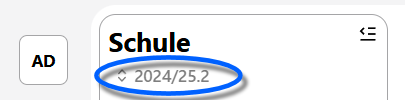

# Datenaustausch

Hier können Sie Daten im- und exportieren. Sofern externe Dienste bestimmte Formate benötigen oder bereitstellen, dienen die Importe und Exporte hier als passende Schnittstelle.

Beispielsweise stehen folgende Dienste zur Verfügung (die Liste kann je nach Entwicklungsstand des SVWS-Webclients und SVWS-Servers ändern).
 
* [WeNoM](./wenom/index.md) - Der das Projekt des MSB zum Verwalten und Synchronisieren der Unterrichtsnoten.
* [Lupo](./lupo/index.md) - Das Laufbahnberatungstool für die Gymnasiale Oberstufe. Hier bezieht sich der Datenaustausch auf das alte Einzelprogramm LuPO, nicht auf WebLuPO. Die Schnittstelle zu WebLuPO findet sich in der App Oberstufe.
* [Lernplattformen](./lernplattform/index.md) - Synchronisation der Benutzer unterschiedlicher Lernplattform, wie zum Beispiel Logineo.
* [Fachanwendungsportal](./fachanwendungsportal/index.md) - Datensynchronisation zum Fachanwendungsportal des Schulministeriums.
* [Schulbewerbung.de](./schulbewerbung.de/index.md) - Synchronisierung der Schüler An- und Abmeldedaten.
* [NBI](./nbi/index.md) - Synchronisation zur Nationalen Bildungsinfrastruktur.

Unter Umständen ist beim Datenaustausch der Lernabschnitt relevant. Der zu Im- oder Exportierende Lernabschnitt kann oben links unter der Überschrift "Schule" geändert werden.
