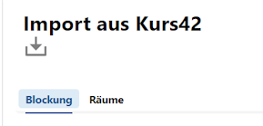

# Import aus Kurs42

## Tab Blockung

Importieren Sie eine mit Kurs42 erstellte Blockung. Hierbei sind folgende Dateien erst aus Kurs42 zu exportieren und dann hier zu importieren:
+ Blockung.txt
+ Schueler.txt
+ Faecher.txt
+ Kurse.txt
+ Schienen.txt
+ Blockplan.txt
+ Fachwahlen.txt

::: warning Es sind folgende Punkte zu beachten:
Diese Text-Dateien müssen für den Import im Hauptverzeichnis einer zip-Datei vorliegen. Die Zeichenkodierung muss UTF-8 ohne BOM sein.

Ein Import kann nur erfolgreich sein, wenn die Daten aus Kurs42 zu den Daten der SVWS-Datenbank passen, ist dies nicht der Fall, schlägt der Import fehl. Achten Sie bitte darauf, dass alle Bezeichnungen identisch sind. 

+ Wurde die Kurs42-Datei quartalsweisein einem vorherigen Lernabschnitt verwaltet, so ist in der Datei *Blockung.txt* der Eintrag *Abschnitt* entsprechend auf das Halbjahr zu korrigieren, für welches die Blockung importiert werden soll.
+ Die Datei *Schueler.txt* muss die korrekten *Schüler-IDs* beinhalten. Sind diese fehlerhaft, so kommt es gegebenfalls zu fehlerhaften oder fehlenden Zuordnungen.
+ Die Blockung wird anschließend nur korrekt dargestellt, wenn die Laufbahnplanungsdaten im Client bereits vorhanden sind, weil die Fachwahlen nicht aus Kurs 42 importiert werden. Daher müssen die Wahlen vor dem Import im Client abgeschlossen sein oder als jahrgangsbezogener Import aus WebLuPO erfolgen.
:::

## Tab Räume

Wurden in Kurs42 noch Räume angelegt, die im SVWS-Server nicht enthalten sind, können Sie diese über den **Tab Räume** importieren. 

Dies sollten Sie tun, bevor die Blockung importiert wird.

Die Datei *raeume.text* muss in der Zeichencodierung *UTF-8 ohne BOM* gespeichert worden sein.

Klicken Sie auf `Datei auswählen`, um die Räume zu importieren.
