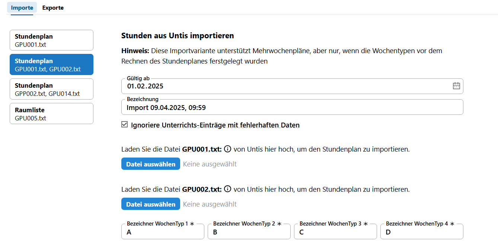
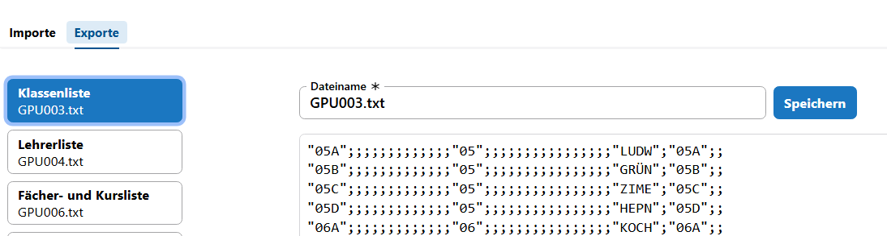
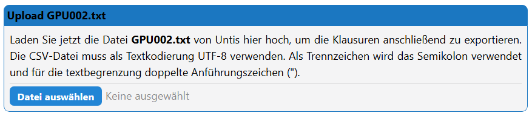

# Datenaustausch mit Untis

In der **App Schule** des SVWS-Webclients können Sie unter dem Menüpunkt **Schule ➜ Datenaustausch ➜ Untis** Daten im Format des externen Programms *Untis* austauschen.

:::info Untis-Support
Konsultieren Sie für den konkreten Aufbau der jeweilgen .txt-Dateien das über die Webseite des Herstellers abrufbare Untis-Handbuch.
Ebenso nutzen Sie das Handbuch und den Untis-Support für den Im- und Export im Programm Untis. Diese Dokumentation beschreibt primär die Nutzung im SVWS-Webclient.
:::

:::warning Beugen Sie Synchronisationsproblemen vor
Achten Sie bitte unbedingt darauf, dass die Bezeichnungen für Kurse, Klassen, Lehrkräfte und Fächer in der SVWS-Datenbank, in Untis und anderen Programmen exakt übereinstimmen. Dies gilt ebenfalls für Schülerdaten wie Vor-, Nachname und Geburtsdatum. Der **Ausgangspunkt** für den Import von Daten sollte immer der SVWS-Webclient sein. Die Bezeichnungen der Klassen, Lehrkräfte, Fächer und Kurse sollten im SVWS-Webclient festgelegt, und die entsprechenden Bezeichnungen in Untis oder anderen Programmen müssen sich exakt daran anpassen. Auch Tippfehler führen mitunter zu Problemen bei einer Datensynchronisation!

Achten Sie bitte auch darauf, immer nur **aktuelle Untis-Dateien zu importieren** nicht alte oder welche, die Änderungen in Untis noch nicht behinhalten!
:::

## Importe: Stundenpläne nach SVWS übernehmen

In den SVWS-Server können Sie *Stundenpläne* auf drei Arten mit unterschiedlichen vielen Informationen einlesen.
| Importmethode | Benötigte Dateien            | Funktion                                               |
|---------------|------------------------------|--------------------------------------------------------|
| Einfach       | `GPU001.txt`                 | Grundlegender Plan (keine A/B-Wochen)                  |
| Mehrwöchig    | `GPU001.txt` + `GPU002.txt`  | Unterstützung für A/B-Wochen mit Unterrichtsgruppen    |
| Echtzeit      | `GPP002.txt` + `GPU014.txt`  | Mehrwochenpläne inkl. Vertretungsdaten                 |

+ *Stundenplan GPU001.txt*: Lesen Sie den grundlegenden Stundenplan (ohne Mehrwochenplansupport) ein. In der GPU001.txt codiert Untis den reinen Stundenplan (keine A/B-Wochen).
+ *Stundenplan GPU001.txt und GPU002.txt*: Mehrwochenpläne werden unterstützt, sofern die Pläne schon mit der korrekten Anzahl an Wochen gerechnet wurden. In der GPU002.txt werden von Untis die Unterrichte selbst codiert.
+ *Stundenplan GPP002.txt und GPU014.txt*: Es werden Mehrwochenpläne unterstützt, achten Sie bitte auf die Ausführungen im SVWS-Client. Achtung: Die GPP002.txt ist **nicht** die GPU002.txt.

### Schritte zum Import im SVWS-Webclient

1. Gehen Sie zu `Schule ➜ Datenaustausch ➜ Untis`
2. Wählen Sie die passende Importvariante
3. Geben Sie das **„Gültig ab“-Datum** an
4. Vergeben Sie eine **Bezeichnung** (z. B. „Stundenplan SJ 2025/26“)
5. Optional: Aktivieren Sie die Checkbox „**Ignoriere fehlerhafte Unterrichtseinträge**“
6. Wählen Sie die Datei(en) aus und starten Sie den Import

:::info Format der Dateien
Alle Dateien sind UTF-8-codierte `.csv`-Dateien.  
Trennzeichen: **Semikolon (;)**  
Textbegrenzung: **Doppelte Anführungszeichen ("")**
:::

In allen Fällen beim Stundenplanimport ist anzugeben, ab wann der importierte Stundenplan gülig sein soll (**Gültig ab**) und wie der importierte Stundenplan im SVWS-Client **bezeichnet** wird. Standardmäßig werden hier Importdatum und Importzeitpunkt in der Bezeichnung hinterlegt.

Ebenso ist über die Checkbox festzulegen, ob Unterrichtseinträge mit fehlerhaften Daten ignoriert d.h. verworfen werden sollen. Sollten Sie fehlerhafte Daten feststellen, empfiehlt es sich, diese Daten vor Im- und Exporten zu bereinigen.

---

## Raumdaten importieren

Über die Datei `GPU005.txt` können Sie die **Raumdefinitionen** (nicht Raumbelegungen!) in den SVWS-Client übernehmen. Diese werden u. a. für die **Klausur- und Raumplanung** benötigt.

---

## Kurswahlen an Untis übergeben

Falls Sie Kurswahlen im SVWS-Client durchführen und anschließend in Untis für die Stundenplanung weiterverwenden möchten, empfiehlt sich folgender Ablauf:

1. Kurswahlen im SVWS-Client erstellen
2. Bereich **Blockung** nutzen, ggf. auch zur Kursverteilung
3. Export als `GPU015.txt`
4. Import dieser Datei in Untis

:::info
Die Datei `GPU015.txt` kann auch importiert werden, wenn Unterrichte in Untis noch nicht manuell angelegt wurden. Sie sollte auf den Planungsdaten des kommenden Schuljahres basieren.
:::

---

## Blockung und Unterrichts-Synchronisation

Wenn Sie mit dem SVWS-Client blocken und in Untis weiterarbeiten möchten, sollten Sie **einmalig eine `GPU002.txt` im SVWS-Client importieren**, damit die Unterrichtszuordnung eindeutig ist und keine Dopplungen auftreten. Der Zeitpunkt (vor oder nach dem Blocken) ist flexibel.

---

## Übersicht wichtiger Untis-Dateien

| Datei         | Inhalt / Zweck                                   |
|---------------|--------------------------------------------------|
| `GPU001.txt`  | Standardstundenplan                              |
| `GPU002.txt`  | Unterrichtsgruppen mit Wochenbezug               |
| `GPU014.txt`  | Wochenraster (z. B. A-/B-Wochen)                  |
| `GPP002.txt`  | Aktueller Unterricht inkl. Vertretungen          |
| `GPU005.txt`  | Raumdefinitionen                                 |
| `GPU015.txt`  | Kurswahlen (Export aus SVWS für Untis)           |

---

## Fehlerbehandlung beim Import

Falls fehlerhafte Unterrichtseinträge beim Import erkannt werden:
- Setzen Sie die Checkbox „Ignoriere fehlerhafte Einträge“, um den Import trotzdem durchzuführen
- Prüfen Sie die Datei im Texteditor (Tipp: Notepad++, VS Code, Editor)
- Typische Fehlerquellen: **Bezeichnungen nicht identisch, nicht vorhandene Kürzel, falsche Datumsbereiche, unvollständige Einträge**

---

# Exporte

Sie können Ihre SVWS-Daten in Units übernehmen. Derzeit können folgende Daten exportiert werden:
+ Klassenliste (GPU003.txt)
+ Lehrerliste (GPU004.txt)
+ Fächer und Kursliste (GPU006.txt)
+ Schülerliste (GPU010.txt)
+ Fachwahlen (GPU015.txt)
+ Klausuren (GPU017.txt)
+ Schienen (GPU019.txt)
+ Blockung (bestehend aus GPU002.txt, GPU015.txt, GPU019.txt)

Wählen Sie die zu exportierende Datenart. Da Untis die eigenen Schnittstellendaten erwartet, sollten für einen Import in Untis bestimmte Dateien nicht unbenannt werden.

Möchten Sie die Daten aus einem anderen Grund exportieren, können Sie der Datei auch einen passenden Namen geben.

Klicken Sie dann auf `Speichern`, um die Datei an einem Ort Ihrer Wahl abzulegen.

### Schüler IDs

Werden Schülerdaten exportiert, legen Sie fest, welche Art der SchülerID Sie nutzen wollen. Zur Wahl stehen die
+ *SVWS-ID*
+ *Untis kurz* bestehend aus Nachname, drei Zeichen des Vornamens und des Geburtsdatums JJJJMMTT
+ *Untis lang*, wie oben, nur dass der volle Vorname verwendet wird

SVWS-IDs haben den Vorteil, dass diese unabhängig von Namensänderungen oder falschen beziehungsweise fehlerhaften Einträgen bei Name, Vorname und Geburtsdatum sind. Wird Untis bei Ihnen mit SVWS-Exporten befüllt, empfiehlt sich diese Wahl.

Schüler-ID-Arten sollten in Untis nicht gemischt werden.

### Unterrichte synchroniseren mit der GPU002.txt

Um zu verhindern, dass Unterrichts-IDs doppelt vergeben werden, muss bei manchen Exporten zuerst eine aktuelle (!) GPU002.txt aus Untis mit eingelesen werden, da in der Zwischenzeit in Untis eventuell neue Unterrichts-IDs erzeugt wurden.

Bevor Sie also einen Export aus dem SVWS-Client anstoßen, erzeugen Sie in Untis eine ganz aktuelle GPU002.txt und übergeben Sie diese dem Export-Dialog im SVWS-Client, dann speichern Sie Ihre Datei und lesen sie diese anschließend in Untis ein.

