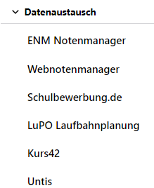

# Schule

## Stammdaten und Kontaktinformationen
In der Übersicht **Schule** werden allgemeine Angaben zur Schule aufgenommen.

Zuerst wird der Katalog **Stammdaten der Schule** als Übersicht angezeigt.

Direkt oben auf der Seite werden Name und Schulnummer angezeigt, darunter lassen sich die **Stammdaten** mit den drei Bezeichungen zur Schule wie auch die Adresse und andere **Kontaktdaten** angeben.

## E-Mail-Server

Geben Sie grundlegende Daten zur Verwendung eines SMTP-Mailservers zur Versendung von E-Mails ein.

Die **konkreten Anmeldedaten** werden in der Schaltfläche zum aktuell angemeldeten **Benutzer** ganz oben links in der Kopfteile des SVWS-Clients eingebenen.

## Katalogübersicht

Es folgt die Katalogübersicht, in der die **Schulbezogenen Kataloge** und die **Allgemeinen Kataloge** aufgeführt werden.

In der zweite Kategorie finden sich alle Kataloge, die nicht mit der konkreten Schule und ihrer jeweiligen Gestaltung zu zun haben. Beispielsweise wären das die existierenden Religionen oder Schulen in NRW - inklusive für die Schulnummern für diverse Ausnahmen wie "Schulen aus dem Ausland".

## Datenaustausch

Es folgt das Menü zum **Datenaustausch**, also die Daten, die über den SVWS-Client in den SVWS-Server importiert und exportiert werden können. 

Hier werden die supporten Programme und Formate direkt angezeigt.

