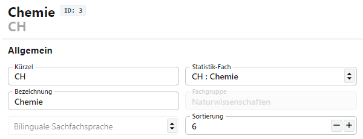

# Fächer

Über diesen Katalog werden die an der Schule unterrichteten **Fächer** eingestellt. Hierbei ist zu beachten, dass ein *Fach* zum einen aus der Bezeichnung, als was das Fach an Ihrer Schule unterrichtet wird und zum anderen aus dem *Statistik-Fach* der Schulstatistik besteht.

Es ist also möglich, dass ein Fach an Ihrer Schule mehrfach angelegt wird (zum Beispiel an einem BK mit vielen Fachrichtungen), für die amtliche Schulstatistik dann als nur ein Statistik-Fach erfasst wird. Weiterhin ist hier darauf zu achten, die aus den Schlüsseltabellen zur Statistik hervorgehenden Vorgaben von IT.NRW einzuhalten, um die Fächer korrekt zu erfassen. Dies ist wichtig, da Versetzungsalgorithmen oder Ähnliches auf  Statistik-Fächer prüfen.

## Auswahlliste

In der Auswahlliste sind die für die Schule konfigurierten Fächer auszuwählen. Wurde ein Fach ausgewählt, können im Bereich rechts die Details zu diesem Fach eingestellt werden.

Über die kleinen **Hoch-Runter-Pfeile ⇅** lässt sich die Auswahlliste wahlweise nach dem *Kürzel* oder der *Bezeichnung* sortieren.

Über das **Plus +** unterhalb der Liste lassen sich neue Fächer anlegen. 

Sie können hier an dieser Stelle auch die Standardsortierung der Sekundarstufe II anwenden lassen. Dabei geht jedoch die aktuell hinterlegt Sortierreihenfolge verloren. Die vom SVWS-Webclient eingestellte Standardsortierung orientiert an den Fachbereichen der Gymnasialen Oberstufe. Die Sortierung von Fächern, die nicht einem Fachbereich der gymnasialen Oberstufe zugeordnet werden können, bleibt erhalten. Soll die Reihenfolge geändert werden, bestätigen Sie mit `OK`, andernfalls klicken Sie auf `Abbrechen`.

## Allgemein und Zeugnisdaten

Über die Tabs lassen sich mit **Fach** die Daten des Faches festlegen. Wurde für die Schule ein **Stundenplan** hinterlegt, in dem dieses Fach eingeplant ist, lässt sich hier auch direkt eine Übersicht aufrufen. 

## Allgemeine Daten

Unter den allgemeinen Einstellungen legen Sie die grundsätzlichen Daten des Faches fest.

* Das **Kürzel** und die an Ihrer Schule verwendete **Bezeichnung**.
* Wählen Sie auch die **Statistik-Bezeichnung**, mit der das Fach erfasst und für die amtlische Schulstatistik verbucht wird. Beachten Sie hier die jeweils aktuellen *Eintragungshilfen* und *Schlüsseltabellen* von IT.NRW zur amtlichen Schulstatistik. Viele Fehler mit Fächern sind in der Praxis, etwa bei Abschlussberechungen und so weiter, auf fehlerhafte oder veraltete Statistikwerte zurückzuführen. Die *Fachgruppe*, zu der das Fach gehört, wird automatisch mit dem **Statistik-Fach** gesetzt.
* Wird das Fach bilungual unterrichtet, setzen Sie die **Bilungaule Sachfachsprache**.
* Über die **Sortierung** lässt sich die Reihenfolge des Faches im Katalog und den Dropdown-Menüs festlegen. Die Liste beginnt mit der Position *0*. Nutzen Sie die Pfeile, um eine andere Sortierung festzulegen oder tragen Sie direkt einen neuen Wert ein.

### Zeugnis

In diesem Bereich steuern Sie, ob und wie die Fächer auf Zeugnissen erscheinen.

Die **Bezeichungen** für das normale **Zeugnis** und das **Überweisungszeugnis** sollten so gesetzt werden, dass sie in die Felder auf den Standard-Zeugnisformularen in die vorgesehenen Felder passen.

Mit dem Schalter **Auf Zeugnis** lässt sich steuern, ob ein Fach grundsätzlich für Zeugnisse berücksichtigt werden soll.

## Sonstiges

Hier lassen sich für Fächer wesentliche Einstellungen vornehmen. 

* Über den Haken **Sichtbar** lässt sich steuern, ob ein Fach in Dropdown-Menüs zur Auswahl gestellt wird oder nicht. Halten Sie die Listen übersichtlich, indem Sie alle nicht-verwendeten Fächer auf nicht-sichtbar stellen. Entfernen Sie zum Setzen der Nicht-Sichtbarkeit den Haken.

* Ist der Haken bei **Fach der Oberstufe** gesetzt, wird das Fach bei der entsprechenden Sortierungsfunktion beachtet. Weiterhin steht es als Oberstufenfach zur Verfügung und kann im Zuge der Laufbahnplanung für einen Abiturjahrgang konfiguriert werden und steht damit für die Laufbahnplanung mit WebLuPO zur Verfügung.

* Über **Ist Prüfungsordnungs-Relevant** lässt sich steuern, ob das Fach grundsätzlich Belegprüfungen oder Ähnlichem herangezogen werden soll.

* Ist das Fach eine **Fremdsprache**, ist der Haken entsprechend zu setzen.

* Gleiches gilt, wenn das Fach eine **in der Oberstufe neu einsetzende Fremdsprache** ist. Diese Einstellung ist für die Laufbahnplanung und Belegprüfungen wichtig.

* Steht das Fach bei Minderleistungen für eine eine Ausgleich ermöglichende Nachprüfungen zur Verfügung, setzen Sie den Haken bei **Nachprüfung erlaubt**, damit der Versetzungsalgorithmus das Fach vorschlagen kann.

* Markieren Sie das Fach über **Schrifliches Fach für ZK**, wenn das Fach bei Zentralen Prüfungen, wie der ZP10, bei den schriftlichen Prüfungen vorgesehen ist.

* Soll das Fach in vorherigen Schuljahren abgeschlossen werden, aber in späteren Zeugnissen berücksichtigt werden, ist es hier über **Berücksichtigen beim Holen von abgeschlossenen Fächern** zu markieren.

* Stellen Sie positive Werte für die **maximale Zeichenzahl in Fachbemerkungen** ein, um die frei oder nach Floskeln zu vergebende Fachbemerkungen in *Schüler ➜ aktueller Abschnitt ➜ Leistungsdaten* in der Eintragslänge zu begrenzen.

::: tip Hinweise auf mögliche Fehlerquellen
* Beim Vergeben von (Zeugnis-)Bezeichnungen ist darauf zu achten, dass diese in die vorgesehenen Felder der Zeugnisse passen.

* Sollten Sie bei der *maximalen Zeichenzahl* eine Grenze vorgeben wollen, achten Sie darauf, dass alle eventuell zugelassenen Floskeln diesen Anforderungen genügen.

* Bei allen unter "Sonstiges" zu setzenden Haken ist sorgfältig zu prüfen, ob sie korrekt gesetzt oder nicht gesetzt sind. Bei Fächern falsch eingestellte Informationen sind eine häufige Quelle für Fehler bei Versetzungs- und Abschlussprüfungen.
:::