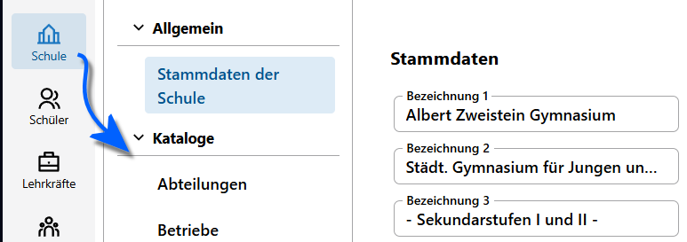

# Kataloge

An vielen Stellen im SVWS-Webclient lassen sich Menüauswahlen treffen, zum Beispiel, in welche Klasse ein Schüler geht oder welche Fächer belegt werden. Solche Auswahlen werden über **Kataloge** voreingestellt.

Andere Kataloge legen die zur Auswahl stehenden Konfessionen, Förderschwerpunkte, Jahrgänge, erfasste Betriebe und so weiter fest. Über die Kataloge wird also die Struktur der Schule eingestellt.

Die **Kataloge** sind über die **App Schule** zu erreichen.

Manche Kataloge enthalten Felder, die den amtlichen Daten für die Schulstatstik entsprechen. Diese Daten sind korrekt zu befüllen.

## Statistische Rahmenbedingungen für Kataloge

Einige Kataloge und die Details zu den Einträgen lassen sich pädagisch recht frei von der Schule konfigurieren, wie zum Beispiel die auf Zeugnisbemerkungen verwendenten Floskeln. Andere Kataloge, wie etwa die angebotenen Jahrgänge mit den jeweilingen Prüfungsordnungen, sind sehr fundamental in der Struktur der Schule verankert und/oder müssen Vorgaben von IT.NRW zur Statistik folgen.

Und wieder andere Kataloge, etwa die zur Verfügung stehenden Nationen oder welche Statistikbezeichnungen hier und dort zu verwenden sind, werden letzendlich durch das MSB und die Bundespolitik vorgegeben und hier passt sich die Schulrealität an die Rahmenbedingungen an.

> [!IMPORTANT] Schauen Sie in die Schlüsseltabellen
> Hierbei hilft ein Blick in die Schlüsseltabellen und Eintragungshilfen von IT.NRW. Über diese ist eindeutig zu klären, welche Fächer es an Ihrer Schulform gibt, wie diese zu erfassen sind oder welche Förderschwerpunkte in welcher Kombination zulässig sind.

Hierbei ist ebenfalls zu beachten, dass es mehrere Katalogeinträge geben kann, die bei der Statistik alle auf den gleichen Statistikeintrag zusammenfasst werden. Beispielsweise könnte es an einem BK für die diversen Bildungsgänge ausdifferenzierend gleich mehrere *Fächer* für etwa "Deutsch" geben, die in der amtlichen Schulstatistik alle nur zu "Deutsch" werden. Ebenso könnten Sie an Ihrer Schule *Konfessionen* erfassen, die für das Land NRW nur als "andere" relevant sind.

Je nach Schulform stehen Ihnen nicht alle Kataloge zur Verfügung. Ein einer Grundschule finden Sie keine Kataloge zur Sekundarstufe II nicht. Im Gegensatz dazu findet an einer weiterführenden Schule keine Erfassung von Kindergärten statt.

> [!IMPORTANT] Datenschtz beachten
> Beachten Sie bitte schon beim Anlegen und Konfiguration der Katalogeinträge, die mitunter zukünftige Arbeitsprozesse für die Schule nahe- oder festlegen, auf die geltenden Bestimmungen zum Datenschutz.

## Arbeiten mit Katalogen

Der Arbeitsprozess mit den **Katalogen** ist hier:
1. Anlegen der Einträge in Katalogen - zum Beispiel die unterrichteten *Fächer*.
2. Anschließend können diese Einträge in den jeweiligen Bereichen des SVWS-Webclients benutzt werden. Nachdem also die Fächer konfiguriert sind, können diese in den individuellen Leistungsdaten des aktuellen Abschnitts den Lernenden hinzugefügt.

Die Struktur der Katalog-Seiten im SVWS-Webclient ist einheitlich:

Die Kataloge beginnen immer mit der Kopfzeile, in der sich das Suchfeld für die Einträge in der Auswahlliste und der Schalter, mit dem *nicht sichtbare Einträge* angezeigt werden können. Standardmäßig sind *nicht sichtbare Einträge* ausgeblendet.

Es folgt die *Auswahlliste* mit den konkereten Katalogeinträgen. 

Diese Liste lässt sich über die kleinen **Hoch-Runter-Pfeile ⇅** neben der *Bezeichnung* alphabetisch auf- oder absteigend sortieren. Sind in der Liste mehrere Felder aufgeführt, zum Beispiel bei *Fächern* die Fachbezeichung und das Fachkürzel, lässt sich nach mehreren Felder auf- oder absteigend sortieren.

Unter der *Auswahlliste* befindet sich der Listenfuß. In diesem befindet sich eine Checkbox, mit der alle Katalogeinträge ausgewählt werden können. Rechts daneben wird die Anzahl der angezeigten Listeeinträge angezeigt.

Klickt man in der *Auswahlliste* auf einen Eintrag, werden rechts davon die *Details* zu diesem Katalog angezeigt. Unterhalb der Details befindet sich der Schalter, um die *Sichtbarkeit* für diesen Katalogeintrag zu steuern.

Je nach Katalog kann es zu kleinen Abweichungen dieser Struktur kommen.

