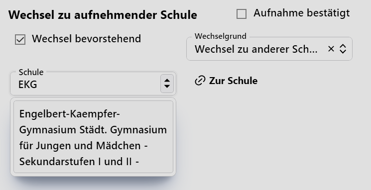

# Schulen

Verwalten Sie die **Schulen**, mit denen Ihre Schule zu tun hat.

Neben den zu erwarteten Werten wie **Schulform**, der **Schulnummer**, dem **Schulnamen** und den diversen **Adress-** und **Kontaktdaten** ist hier das Feld **Kürzel** beachtenswert.

Haben Sie ein **Kürzel** vergeben, lässt sich in Feldern, in denen die Schule erfasst wird, das Kürzel eingeben und Sie wählen so direkt die Schule aus.

## Eine Anwendung als Beispiel

Eine Schule wird zum Beispiel bei einem Schulwechsel in der **App Schule ➜ Schulbesuch** im Bereich **Wechsel zu aufnehmender Schule** benötigt.

Hier im Beispiel ist zu sehen, dass im Feld das vergebene **Kürzel** getippt wurde und es steht direkt die zu dem Kürzel gehörende Schule zur Auswahl.

Dieses Vorgehen ist bei allen anderen Feldern, in denen Schulen einzugeben sind zu verwenden.