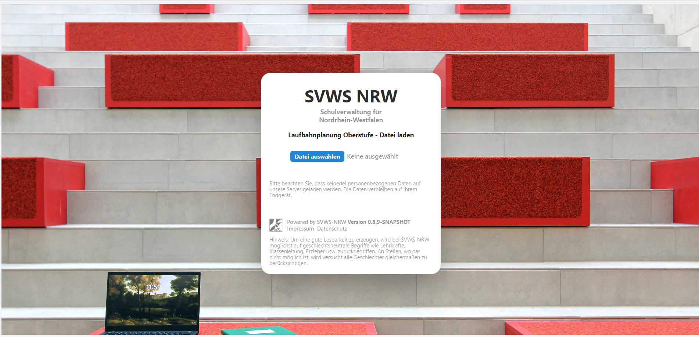

# WebLuPO 

WebLuPO ist ein webbasiertes Tool zur Laufbahnberatung und -planung iom Browser für die gymnasiale Oberstufe in NRW. Hier befindet sich die [Installationsanleitung und die technische Dokumentation](../projekte/WebLupo/)

In diesem Artikel wird die Benutzung einer `.lp`-Datei erklärt, die von den betreuenden Lehrkräften bereitgestellt wurde. Den passenden Link zur Webseite erhalten Sie ebenfalls von den Lehrkräften.

## Berarbeitung in WebLuPO



Startet man WebLuPO, ist auf diesem Bildschirm die individuelle `.lp`-Datei hochzuladen.

Klicken Sie auf `Datei auswählen` und navigieren Sie dann auf dem Rechner zur Datei.

::: info Die Verarbeitung findet auf dem lokalen Rechner statt
Hierbei wird das WebKuPO nur im Browser auf dem aktuellen Rechner ausgefürht. Somit werden weder ein bestimmtes Betriebssystem vorausgesetzt noch verlassen die Daten das Endgerät, an dem gearbeitet wird.
:::

## Die Oberfläche von WebLuPO.

Die folgende Grafik zeigt die vier Bereiche der Laufbahnberatungstools:

 

* Im ersten Bereich können Sie den *Modus* einstellen und haben Zugriff auf Speicher- und Bearbeitungsmöglichkeiten.   

* Im zentralen zweiten Bereich werden die Kurswahlen vorgenommen. Der Modus *normal* und *hochschreiben* füllt automatisch die angegebenen Fachwahlen auf und passt sie so wie es sinnvoll erscheint an die höheren Jahrgänge an. Durch einen Doppelklick auf die einzelnen Felder der Tabelle im zweiten Bereich können Sie je nach Kontext zwischen *M* für *mündlich* und *S* für *schriftlich* und dann in der Q-Phase zwischen *M* für *Grundkurs mündlich* und *S* für *Grundkurs schriftlich*, dem immer schriftlichen *Leistungskurs*, *Projektkurs* und so weiter wählen.

* Im dritten Bereich wird automatisch die Anzahl der belegten und anrechenbaren Kurse mit den belegten Stundenzahlen berechnet. Die Farbgebung von rot bis dunkelgrün gibt Ihnen direkt Feedback zur Anzahl der Kurse. Bei einer *roten* Farbe sind zu wenige Stunden im Halbjahr beziehungsweise der EF oder der ganzen Q-Phase belegt. *Hellgrün* eingefärbte Stunden entsprechend den Vorgaben. Eine Einfärbung in *Dunkelgrün* weist darauf hin, dass deutlich mehr Stunden als nötig gewählt wurden und das Abwahlen - jetzt oder später - möglich sein könnten.

* Im vierten Bereich werden die Regeln für die Oberstufenbelegung algorithmisch ausgewertet und die noch zu erfüllenden Bedingungen angezeigt beziehungsweise es wird auf Fehlbelegungen hingewiesen. Hier kann der Modus *EF.1*, *Gesamtprüfung* oder *automatisch* gewählt werden.   

Interessant ist auch die Einstellung ````Planung merken```` im ersten Bereich, die das Festhalten einer Einstellung in der Tabelle ermöglicht. Wird die Planung dann testweise geändert, kann die gemerkte Planung wiederhergestellt werden.

Somit können Schülerinnen und Schüler von diesem Ausgangspunkt aus schnell mehrere Planungen ausprobieren und wieder zurücksetzen. 

## Exportieren der Wahlen
