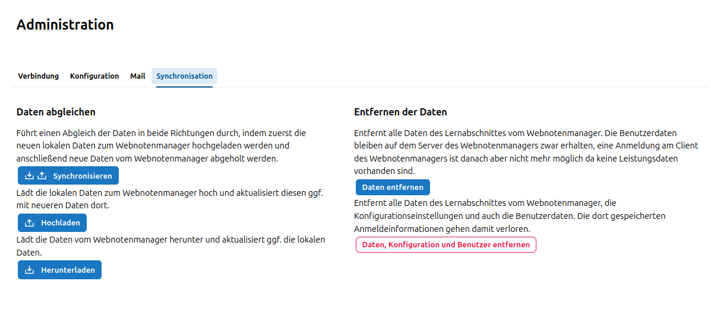
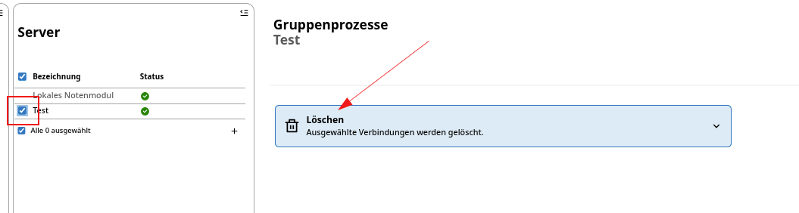
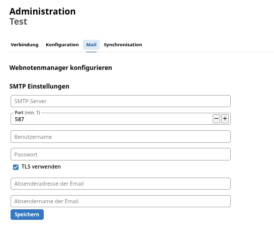

# Ersteinrichtung

Damit sich eine Lehrkraft anmelden kann, muss zuerst eine Synchronisation mit dem SVWS-Server eingerichtet werden. Erst dann werden die WeNoM-Daten, wie beispielsweise die persönlichen Lehrkraftzugänge, die Möglichkeit, E-Mails zu senden, oder die Klassen- und Kurslisten für die Notenerfassung, befüllt.

Für die Einrichtung der Synchronisation wird ein sogenanntes *Secret* benötigt, das bei der Ersteinrichtung im Zuge der technischen Installation erzeugt wird. Dies ist Aufgabe der für die Schule zuständigen technischen Administration/IT-Abteilung.

Die Einrichtung der Synchronisation wird in der **Installationsanleitung und technischen Dokumentation** im Inhaltsverzeichnis beschrieben. 

## Einrichtung der Synchronisation mit dem SVWS-Server

Die Einrichtung der Synchronisation mit dem SVWS-Server obliegt der für die Schule zuständigen **schulfachlichen Administration** (gegebenfalls Schulleitung, Stellvertretung oder Beauftragte). Es werden somit höhere Rechte beim Benutzer des SVWS-Servers benötigt. Das oben genannte Secret und die URL des WeNoM liegen dem schulfachlichen Administrator vor.

Die Konfigurationsoberfläche für den WebNotenmanager befindet sich im Webclient des SVWS-Servers unter:

Noten ➜ Serververbindungen ➜ Verbindung. 

 Hier werden das der schulfachlichen Administration vorliegende Secret und die URL eingetragen. Bitte hierbei auf die Schreibweise achten. Beispiel:
 
    https://wenom.ihre-domain.de

Nachdem die Verbindungsdaten erfolgreich eingegeben wurden, wird ein automatischer Verbindungstest durchgeführt. 

## Fehler bei der Einrichtung 

### Abweichungen des internen Names

Möglicherweise ist die URL vom SVWS-Server aus nicht auffindbar. Dies könnte an den Einstellungen eines Proxyservers liegen.

Hier könnte eine direkte Angabe der IP-Adresse statt des DNS-Namens erfolgen oder es könnte die Eingabe von `http://` statt `https://` ausprobiert werden. 

### Benutzung eines internen Zertifikats

In manchen seltenen netzinternen Umgebungen kann die Frage auftreten, ob dem eigenen Zertifikat vertraut werden soll. Dies kann in Absprache mit dem technischen Admin durch Setzen des Hakens bestätigt werden. 

### Verbindung prüfen 

Sind die Zugangsdaten eingerichtet, kann die Verbindung jederzeit unter „Verbindungsdaten einrichten” geprüft werden. 

### Synchronisation

Nachdem die Verbindung zum WeNoM-Server im SVWS-Server eingerichtet wurde, kann die schulfachliche Administration auf der oben genannten Konfigurationsoberfläche des SVWS-Servers die Synchronisation zwischen beiden Datenbeständen ausführen.

In besonderen Fällen kann nur hoch- beziehungsweise runtergeladen werden. In der Regel werden die Datenbestände jedoch direkt synchronisiert, was einem Hochladen mit anschließendem Herunterladen entspricht.

Dabei wird anhand eines *Zeitstempels* in beiden Datenbeständen entschieden, welcher Eintrag der neuere ist und dieser wird dann für den SVWS-Server übernommen. 

## Zurücksetzen / Daten löschen

Über den Punkt **Zurücksetzen** bietet sich der schulfachlichen Administration die Möglichkeit, 

+ Daten zurücksetzen
+ Daten und Benutzer zurücksetzen. 

Im normalen halbjährlichen Schulabschnittswechsel können mit dem Punkt `Daten zurücksetzen` alte Zeugnisdaten zur Sicherheit noch einmal aus dem über das Internet erreichbaren System genommen werden, sodass das neue Halbjahr sauber begonnen werden kann. 

Falls ein Webnotenmanager aufgegeben werden soll und der schulfachliche Administrator somit die Löschung aller Daten auf dem Wenom-Server durchführen muss, kann dies über `Daten und Benutzer zurücksetzen` erreicht werden. 

### Verbindungsdaten löschen / erneuern

Wenn ein neues Secret benötigt wird oder ein Wenom-Server gelöscht werden soll, können die noch eingetragenen Zugangsdaten unter `Verbindungsdaten einrichten` gelöscht bzw. erneuert werden. 

::: danger Achtung!
Die Daten, die sich auf dem WeNoM-Server befinden, werden dabei nicht gelöscht. Es wird nur die Verbindungsmöglichkeit gelöscht. (Diese kann gegebenfalls auch wiederhergestellt werden, falls das Secret des WeNoM-Servers noch gültig ist.) 
:::
 
## Zugänge der Lehrkräfte

Die Lehrkräfte erhalten von der schulfachlichen Administration ein *Initialpasswort*. In Kombination mit der *Dienstlichen Emailadresse* ist dieses Kenntwort der individuelle Zugang zum WebNotenManager. 

Ungültige oder uneindeutige Email-Einträge in den Dienstmails werden als Fehler markiert und nicht zum WeNoM-Server übertragen. Ebenso werden nur die Dienstmailadressen und keine privaten E-Mail-Adressen des Lehrerdatensatzes als Zugangsdaten verwendet.

Falls unter **Mail** eine gültige Emailadresse zum Versenden von Nachrichten für den WeNoM-Server eingetragen ist, können sich die Lehrkräfte statt des Initialpassworts ein neues Initialpasswort zuschicken lassen. 

(Diese Funktion ist in Version 1.0.12 noch nicht aktiviert.)
