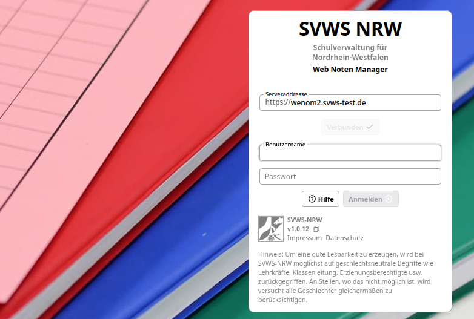
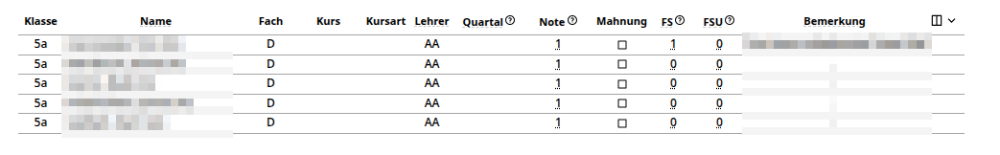
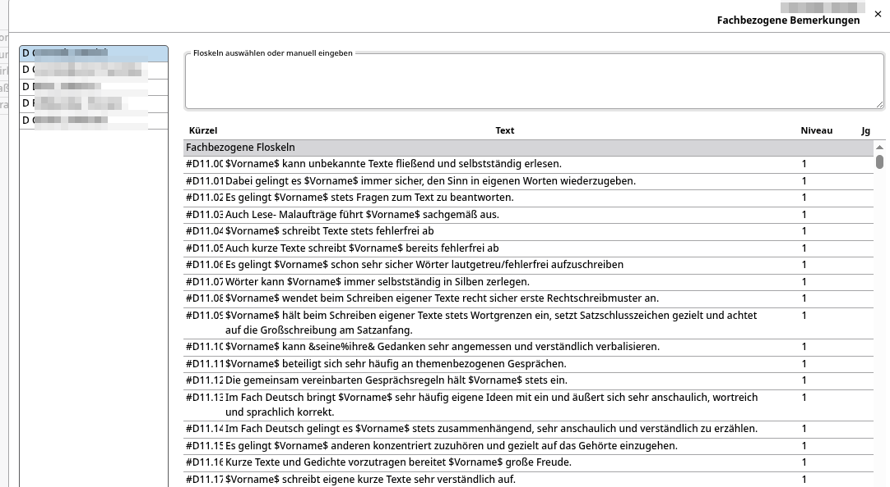
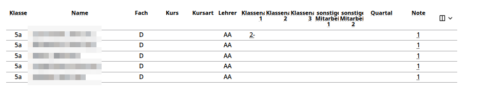
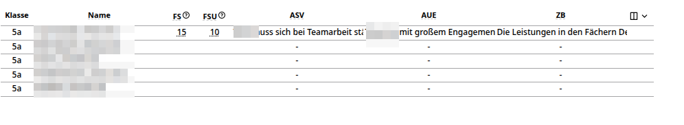

## Anmeldung einer Lehrkraft

Den **Lehrkräften** wurde in der Schule ein *Initialpasswort* gegeben, das sie unter Anwahl der URL ihres Wenom-Servers eingeben können. Der Benutzername ist die *dienstliche Emailadresse*.

Nach dem Login öffnet sich in der Regel der Leistungsdatenreiter mit der vorausgewählten ersten Lerngruppe der Lehrkraft. 

Je nach Rolle der Lehrkraft kann die Ansicht variieren. Es wird zwischen den folgenden Möglichkeiten und den im Folgenden beschriebenen Geschäftsprozessen unterschieden:

+ Fachlehrkraft
+ Klassenleitung
+ Schulleitung bzw. Abteilungsleitung

### Grundsätzliche Tabelleneinstellungen

**GRAFIK TODO**

In der Ansicht können Lerngruppen in die Tabellenübersicht aufgenommen beziehungsweise abgewählt werden. Am rechten Rand der Tabelle können Spalten ein- und ausgeblendet werden. Je nach Benutzer können bis zu drei verschiedene Tabellen aufgerufen werden. 

+ Leistungsdaten
+ Teilleistungen
+ Klassenleitung

## Eintragungen der Fachlehrkraft

### Leistungsdaten

#### Noten eintragen

Die **Fachlehrkraft** kann die Noten für ihren eigenen Unterricht in den Leistungs- bzw. Teilleistungsdaten eingeben. Hierbei können ganze Noten (1, 2, 3, …) bzw. gebrochene Notenwerte (3+, 3, 3-, …) eingegeben werden. In den Leistungsdaten können die folgenden Notenarten spaltenweise eingegeben werden: 

+ Quartalsnoten
+ Note (als End- bzw. Zeugnisnote zu verstehen)

#### Mahnungen setzen

Unter den Leistungsdaten können Mahnungen neu gesetzt oder bereits ausgesprochene Mahnungen von der Lehrkraft nachgesehen werden. 

Ist die Checkbox mit einem Haken versehen und inaktiv, das heißt der Zustand der Checkbox kann nicht mehr verändert werden, dann handelt es sich um eine *ältere Mahnung*, die dem Schüler zum Beispiel im letzten Halbjahr durch die Vergabe eines Defizits ausgesprochen wurde.

Mit dem entsprechenden Schüler ausgewählte Mahnungen sind am gesetzten Haken erkennbar und zusätzlich durch ihre rote Färbung. Diese können auch weiterhin von der Lehrkraft bearbeitet werden.

Erst im Zuge der Weiterverarbeitung im SVWS-Webclient wird der Zustand einer versendeten beziehungsweise ausgesprochenen Mahnung erreicht. Das bedeutet, dass die Checkbox erst nach der Verarbeitung im SVWS-Webclient und der erneuten Synchronisation mit dem WeNoM-Server auf „angehakt” und „inaktiv” wechselt.

Somit kann die Lehrkraft nachvollziehen, dass die Mahnung offiziell versendet beziehungsweise ausgesprochen wurde. 

#### Fachbezogene Fehlstunden eintragen

Im Bereich „Fehlstunden” können fachbezogene Fehlstunden (FS) als ganze Zahl eingegeben werden. Die Anzahl der unentschuldigten Fehlstunden (FSU) wird in der benachbarten Spalte eingetragen. 

#### Eintragungen fachbezogene Bemerkungen

Durch Klicken auf „Fachbezogene Bemerkungen” öffnet sich ein modales Fenster. Zuerst ist der zuvor ausgewählte Schüler ausgewählt, es können können aber auch alle weiteren Schüler der entsprechenden Lehrgruppe auf der linken Seite ausgewählt werden.

Im unteren Bereich können vorformulierte Floskeln entweder durch Eingabe des Kürzels oder durch Anklicken übernommen und beim Schüler eingetragen werden.

### Teilleistungen

Als Teilleistungen werden Unternoten eines Faches bezeichnet, dies sind zum Beispiel für *Sonstige Mitarbeit*, *Klausuren und Klassenarbeiten* oder *ZP10-Prüfungsleistungen*.

Diese können je nach Schulform und Schule in ihrer Anzahl und in ihrer Bezeichnung variieren.

Im Reiter „Teilleistungen” findet man eine Übersicht über alle in dieser Lerngruppe durch den zentralen SVWS-Server vorgegebenen Teilleistungsarten. 

Alternativ zum Leistungsdatenreiter können hier auch die Quartals- und Endnoten eingetragen werden. 

## Eintragungen der Klassenleitung

### Klassenleitung: FS und FSU

Der Reiter „Klassenleitung” ist nur für Klassenlehrkräfte sichtbar. Hier werden fachübergreifende Fehlstunden ("FS" für "Fehlstunden" und FSU für "Unentschuldigte Fehlstunden"), also die Gesamtfehlstunden, verwaltet, falls sich die Schule beziehungsweise die Abteilung für eine direkte Erfassung der Gesamtnoten entschieden hat. 

### ASV, AUE und ZB

Unter den Spalten ASV (Arbeits- und Sozialverhalten), AUE (außerunterrichtliches Engagement) und ZB (Zeugnisbemerkung) können jeweils in diesen unterschiedlichen Kontexten Bemerkungen eingetragen werden.

Ebenso wie bei den fachbezogenen Bemerkungen kann hier auf vorformulierte Floskeln zurückgegriffen werden. Zum Bearbeiten des Textes öffnet sich ein modales Fenster (siehe auch fachbezogene Bemerkungen).
 

## Tätigkeiten der Schulleitung/Abteilungsleitung

Die Schul- und Abteilungsleitung hat im Grunde die gleiche Ansicht wie eine Klassen- beziehungsweise die Fachlehrkraft. Es werden lediglich alle Lerngruppen der Schule beziehungsweise der Abteilung zur Auswahl präsentiert.

Die Tätigkeiten beschränken sich hier stark auf das Sichten der Noten zu Beratungszwecken. Gegebenenfalls können Noten und Bemerkungen von erkrankten Lehrkräften eingesehen werden.
