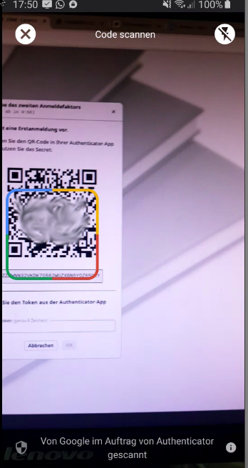
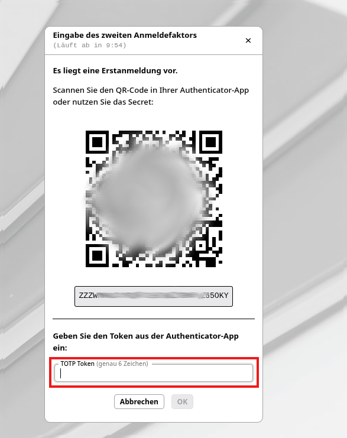

# Einrichtung der Zwei-Faktor-Authentisierung 

Im Umgang mit sensiblen Daten über das Internet wird es nötig sein eine Zweifaktor Authorisierung für jeden Benutzer einzurichten. Ist dies durch den schulfachliche Administrator eingeschaltet worden, so erhält der Benutzer beim nächsten login die Aufforderung den Zweiten Faktor einzurichten. 

## Zweifaktor App installieren

Sie benötigen eine Zwei-Faktor-App. Dies kann in mehreren verschiedenen Varianten auf localen Desktop systemen, iPads oder auch Handys hinterlegt sein. Hier ein Beispiel einer Handy App: 

+ Richten Sie eine neue Verbindung ein (oft ein Plus-Zeichen).
+ Scannen Sie den QRCode

+ Übertragen Sie den 6-stelligen Code, der auf dem Endgerät angezeigt wird, in die Eingabe unter TOTP Token (vgl. roter Kasten)

Damit ist die Zweifaktor Authentifizierung eingerichtet und kann beim nächsten login benutzt werden. 
