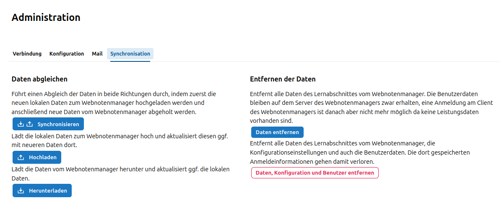
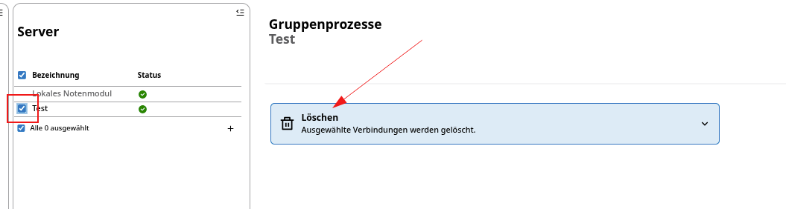
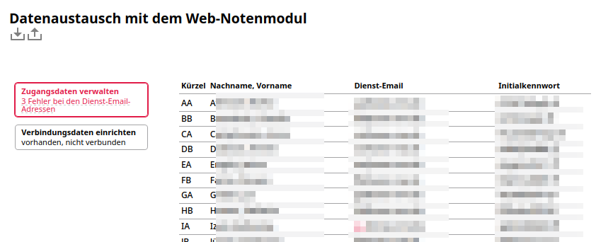
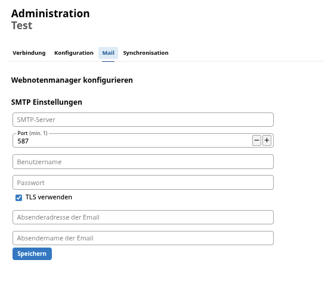
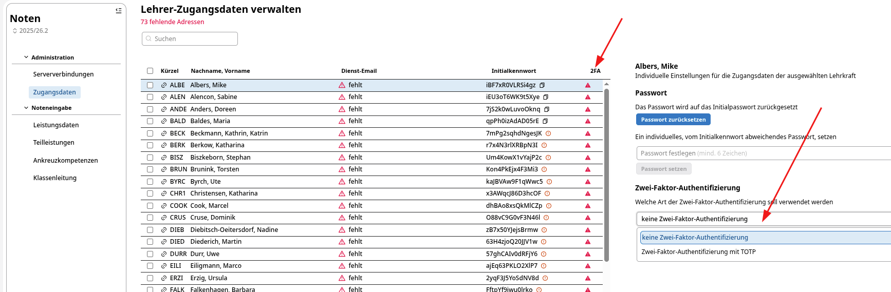
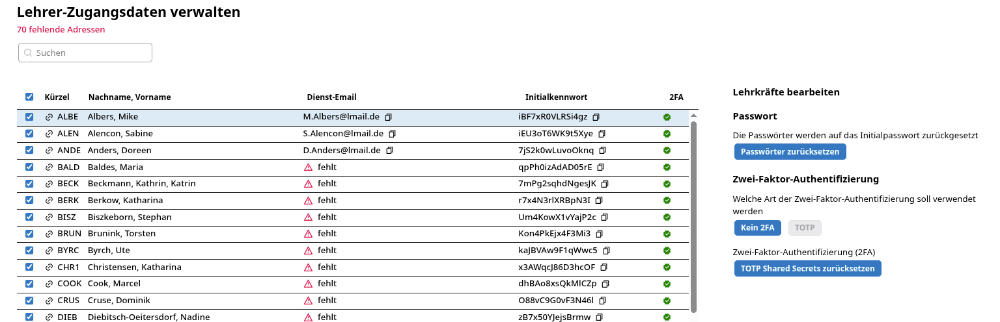
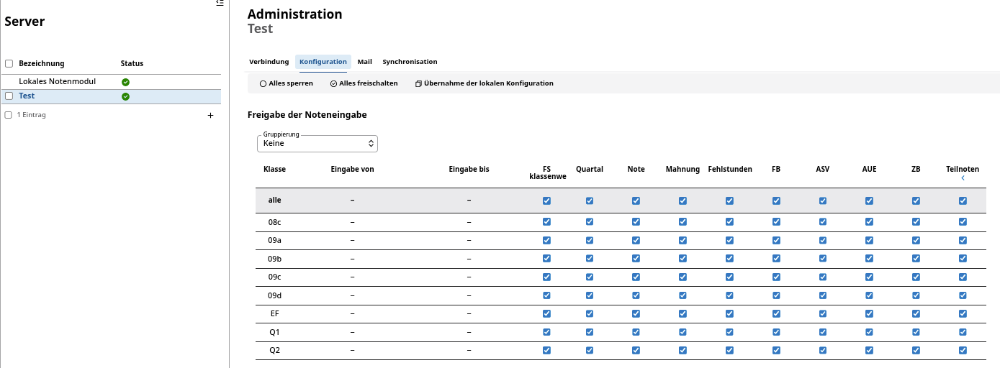
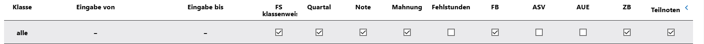
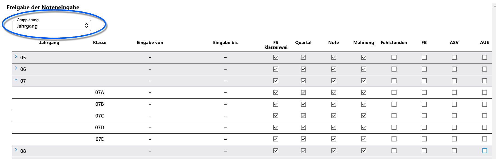
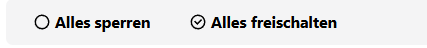

# Administrative Arbeit mit WeNoM

## Ersteinrichtung WeNoM

Damit WeNoM und der SVWS-Server miteinander kommunizieren bzw. synchronisieren können, muss ein erstmalig internes Passwort, ein sogenanntes *Secret* eingerichtet werden. Eine Beschreibung der Einrichtung befindet sich unter [technische Ersteinrichtung](../installation/ersteinrichtung.md).

## Synchronisation

Nachdem die Installation und Ersteinrichtung und damit die erfolgreiche Verbindung zum WeNoM-Server im SVWS-Server eingerichtet wurde, kann die schulfachliche Administration auf der Konfigurationsoberfläche des SVWS-Servers die Synchronisation zwischen beiden Datenbeständen ausführen.

 In der Regel werden die Datenbestände *synchronisiert*, was einem Hochladen mit anschließendem Herunterladen entspricht.

Dabei wird anhand eines *Zeitstempels* in beiden Datenbeständen entschieden, welcher Eintrag der Neuere ist und der Eintrag mit dem neuesten Datum wird für den SVWS-Server erhalten beziehungsweise vom WeNoM übernommen.

Beim Synchronisieren werden ebenfalls die Benutzer abgeglichen, so dass es für den WeNoM ausschließlich Benutzer gibt, die im SVWS-Server vorhanden sind.

In besonderen Fällen kann nur hoch- beziehungsweise heruntergeladen werden, so dass kein beidseitiger Abgleich über die Datumsstempel stattfindet.

## Zurücksetzen / Daten löschen

Über den Punkt **Zurücksetzen** bietet sich der schulfachlichen Administration die Möglichkeit,

+ **Daten** zurücksetzen
+ **Daten und Benutzer** zurücksetzen.

Im normalen, halbjährlichen Schulabschnittswechsel können mit dem Punkt `Daten zurücksetzen` alte Zeugnisdaten zur Sicherheit aus dem, über das Internet erreichbare, System genommen werden. Zum einen sind diese Daten dann überhaupt nicht mehr in WeNoM abrufbar und zum anderen kann ein neuer Lernabschnitt auf dem WeNoM sauber begonnen werden.

Falls ein installierter Webnotenmanager vollständig aufgegeben oder vollständig neu initialisiert werden soll und der schulfachliche Administrator somit die Löschung aller Daten auf dem WeNoM-Server durchführen muss, kann dies über den Schalter `Daten und Benutzer zurücksetzen` erreicht werden.

### Verbindungsdaten löschen oder erneuern

Wenn ein neues Secret benötigt wird oder ein Wenom-Server gelöscht werden soll, können die noch eingetragenen Zugangsdaten unter `Verbindungsdaten einrichten` gelöscht, beziehungsweise erneuert werden.

::: danger Achtung, die Daten sind nicht gelöscht!
Die *Daten*, die sich auf dem WeNoM-Server befinden, werden dabei nicht gelöscht. Es wird lediglich die *Verbindungsmöglichkeit* entfernt.

Die Möglichkeit zur Verbindung kann gegebenenfalls wiederhergestellt werden, falls das *Secret* des WeNoM-Servers noch gültig ist.
:::

## Zugänge der Lehrkräfte

Die Lehrkräfte erhalten von der schulfachlichen Administration ein *Initialpasswort*. In Kombination mit der *Dienstlichen Emailadresse* als Benutzername ist dieses Kennwort der individuelle Erstzugang zum WebNotenManager.

Ungültige oder uneindeutige Email-Einträge in den Dienstmails werden als Fehler markiert und nicht zum WeNoM-Server übertragen.

Ebenso werden ausschließlich Dienstmailadressen und keine privaten Email-Adressen des Lehrerdatensatzes als Zugangsdaten verwendet.

Falls unter **Mail** eine gültige Emailadresse zum Versenden von Nachrichten für den WeNoM-Server eingetragen ist, können sich die Lehrkräfte ein neues Initialpasswort zuschicken lassen.

(Diese Funktion ist in Version 1.0.12 noch nicht aktiviert.)

## Einrichten einer Zwei-Faktor-Authentifizierung

Sie können unter **Noten-> Administration -> Zugangsdaten** individuell oder auch gruppenweise die Zwei-Faktor-Authentifizierung aktivieren.

Bei der Mehrfachauswahl von Benutzern können über den Eintrag `Zwei-Faktor-Authentifizierung mit TOTP` aus dem Dropdown-Menü alle Benutzer verpflichtet werden, die Zwei-Faktor-Authentifizierung beim ersten Login einzurichten.

An dieser Stelle können Authentifizierungen einzelner Benutzer beziehungsweise alle Zwei-Faktor-Authentifizierungen zurückgesetzt werden.

Dies ist bei Verlust oder Diebstahl eines Endgerätes eine Möglichkeit, die Sicherheit der Daten zu wahren und Fremdzugriffe auszuschließen.

Am *grünen Haken* unter 2FA ist zu erkennen, dass die Zwei-Faktor-Authentifizierung für diese Benutzer eingeschaltet ist.

::: danger Weitere Synchronisation notwendig!
Die Einstellungen werden erst durch eine erneute Synchronisation auf dem WeNoM-Server übertragen!
:::

## Konfiguration

Im Tab **Konfiguration** eines WeNoM-Servers lässt sich einstellen, welche Spalten bei der Noten- und Leistungsdateneingabe und im Klassenleitungsbereich jeweils klassenweise befüllt und geändert werden können.

Setzen Sie bei einer Klasse die Checkboxen wie beabsichtigt, um die jeweiligen Einträge für Benutzer schreibbar zu machen.

Unterhalb der Checkbox-Matrix lassen sich Spalten vollständig ein- oder ausblenden.

Hier können Sie auch steuern, welche **Teilleistungen** zur Noteneingabe angezeigt werden.

Über die Kopfzeile lassen sich die Einträge auch für alle Klassen auf einmal umändern.

Über das Dropdown-Menü "Gruppierung" können Sie Klassen nach *Jahrgängen* oder *Abteilungen* zusammenfassen und so übersichtlich mit wenigen Checkboxen im Gruppenkopf steuern. Heben Sie eine Gruppierung auf, indem Sie den Eintrag wieder auf *keine* stellen.

Eine Gruppe lässt sich auch aufklappen, so dass für eine Klasse abweichende  Einstellungen vorgenommen werden können.

Oben links können Sie über die beiden Schalter `Alles sperren` und `Alles freischalten` alle Checkboxen auf einmal setzen.

::: tip Denken Sie ans Synchronisieren
Zum Abschluss Ihrer Arbeiten synchronisieren Sie die Daten mit ihrem WeNoM.
:::

## Mail