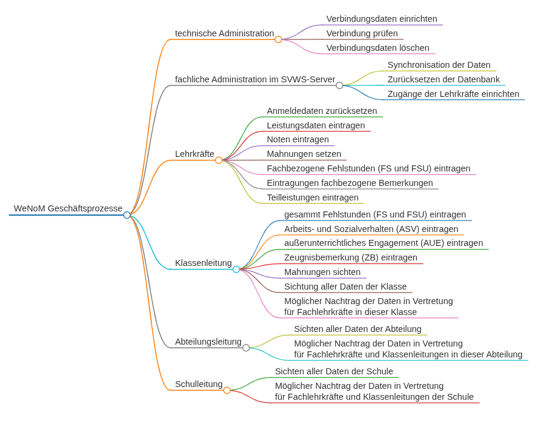

# WeNoM Geschäftsprozesse

Eine ausführliche Beschreibung der Geschäftsprozesse befindet sich im **Benutzerhandbuch WeNoM**, das über das Inhaltsverzeichnis oben zu erreichen ist.

## technische Administration  

### Verbindungsdaten einrichten 

### Verbindung prüfen 

### Verbindungsdaten löschen

## fachliche Administration im SVWS-Server

### Synchronisation der Daten

### Zurücksetzen der Datenbank 

### Zugänge der Lehrkräfte einrichten

## Lehrkräfte 

### Anmeldedaten zurücksetzen

### Leistungsdaten eintragen

### Noten eintragen

### Mahnungen setzen

### Fachbezogene Fehlstunden (FS und FSU) eintragen

### Eintragungen fachbezogene Bemerkungen

### Teilleistungen eintragen

## Klassenleitung

### gesammt Fehlstunden (FS und FSU) eintragen

### Arbeits- und Sozialverhalten (ASV) eintragen

### außerunterrichtliches Engagement (AUE) eintragen

### Zeugnisbemerkung (ZB) eintragen

### Mahnungen sichten

### Sichtung aller Daten der Klasse

### Möglicher Nachtrag der Daten in Vertretung für Fachlehrkräfte in dieser Klasse

## Abteilungsleitung

### Sichten aller Daten der Abteilung

### Möglicher Nachtrag der Daten in Vertretung für Fachlehrkräfte und Klassenleitungen in dieser Abteilung

## Schulleitung

### Sichten aller Daten der Schule

### Möglicher Nachtrag der Daten in Vertretung für Fachlehrkräfte und Klassenleitungen

