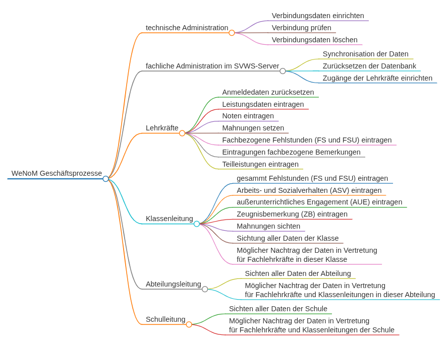

# Geschäftsprozesse

**Webnotenmanager (WeNoM)**

Eine Ausführliche Beschreibung der Geschäftsprozesse befindet sich im [Benutzerhandbuch WeNoM](wenom_handbuch.md).

## technische Administration  

|   |   |   |   |
|---|---|---|---|
| Verbindungsdaten einrichten 
| Verbindung prüfen 
| Verbindungsdaten löschen

## fachliche Administration im SVWS-Server

|   |   |   |   |
|---|---|---|---|
| Daten zwischen SVWS-Server und WENOM-Server synchronisieren
| Datenbank des WENOM-Servers zurücksetzen
| Zugänge der Lehrkräfte einrichten

## Lehrkräfte 

|   |   |   |   |
|---|---|---|---|
| Anmeldedaten zurücksetzen
| Leistungsdaten eintragen
| Noten eintragen
| Mahnungen setzen
| Fachbezogene Fehlstunden (FS und FSU) eintragen
| fachbezogene Bemerkungen eintragen
| Teilleistungen eintragen

## Klassenleitung

|   |   |   |   |
|---|---|---|---|
| gesammt Fehlstunden (FS und FSU) eintragen
| Arbeits- und Sozialverhalten (ASV) eintragen
| außerunterrichtliches Engagement (AUE) eintragen
| Zeugnisbemerkung (ZB) eintragen
| Mahnungen sichten
| alle Daten der Klasse sichetn
| Daten in Vertretung für Fachlehrkräfte in dieser Klasse nachtragen

## Abteilungsleitung

|   |   |   |   |
|---|---|---|---|
| alle Daten der Abteilung sichten
| Daten in Vertretung für Fachlehrkräfte und Klassenleitungen in dieser Abteilung nachtragen

## Schulleitung

|   |   |   |   |
|---|---|---|---|
| alle Daten der Schule sichten
| Daten in Vertretung für Fachlehrkräfte und Klassenleitungen dieser Schule nachtragen

