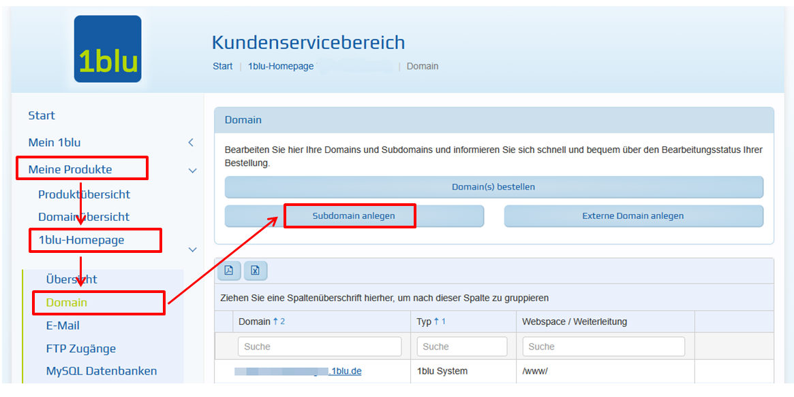
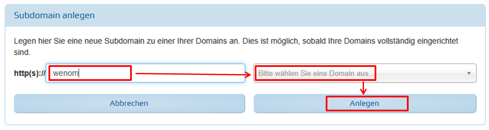
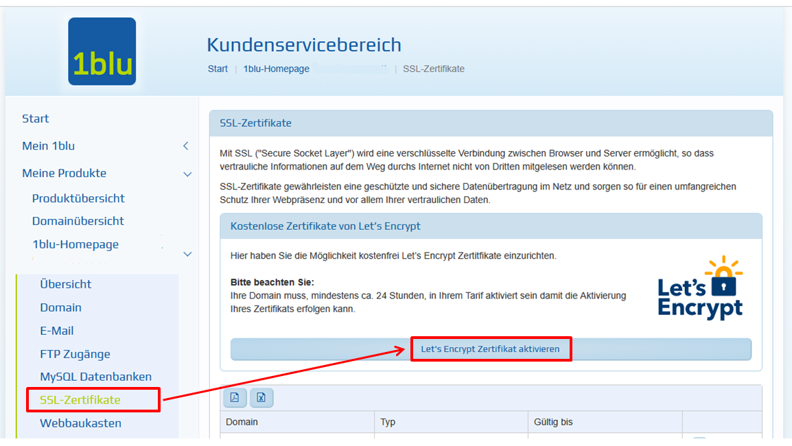

# Webspace 1blu

## Voraussetzungen

+ Sie haben einen Webspace bei 1blu.
+ Sie haben einen FTP-Zugang zum Dateisystem des Webhostings.
+ Sie können eine Subdomain anlegen.
+ Sie können ein Zertifikat für die Subdomain erstellen.

## FTP Verbindung aufbauen und Dateien hochladen

Verbinden Sie sich mit Ihrem FTP-Benutzer und erstellen Sie im Verzeichnis "www" ein Unterverzeichnis, z. B. "wenom", in das die WeNoM-Dateien abgelegt werdenb sollen. Laden Sie die Dateien aus der ZIP-Datei in das neu erstellte Verzeichnis Verzeichnis hoch.

Sie haben nun folgende Verzeichnisse:
- www
  -- wenom
     --- app
     --- db
     --- public
Setzen Sie für die Verzeichnisse "app" und "public" die Rechte auf 755. Beziehen Sie dabei alle Unterverzeichnisse  und Dateien mit ein:

Setzen Sie für das Verzeichnisse "db" die Rechte auf 770. Beziehen Sie dabei alle Unterverzeichnisse  und Dateien mit ein:

## Subdomain anlegen und Zertifikat zuweisen

Loggen Sie sich in den Kundenbereich von 1blu ein.
Legen Sie zu Ihrem Produkt unter "Domain" eine Subdomain an.

Aktivieren Sie für diese Subdomain ein SSL-Zertifikat für die sichere Verbindung.

## Einrichtung

Weiter geht es mit der [Ersteinrichtung](../installation/ersteinrichtung.md) des WebNotenManagers.
