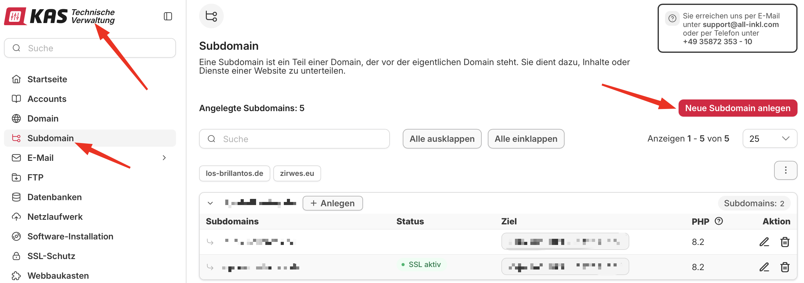
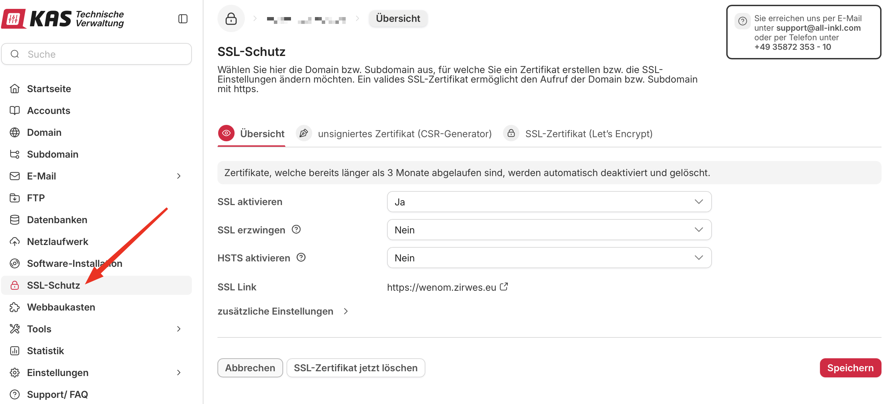
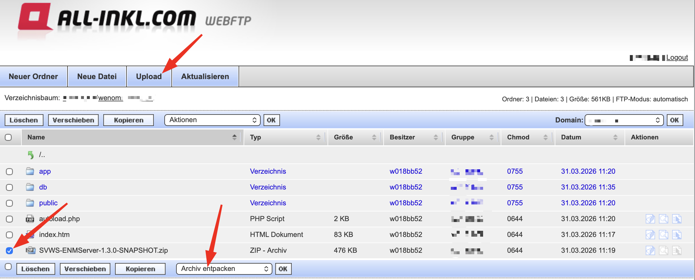
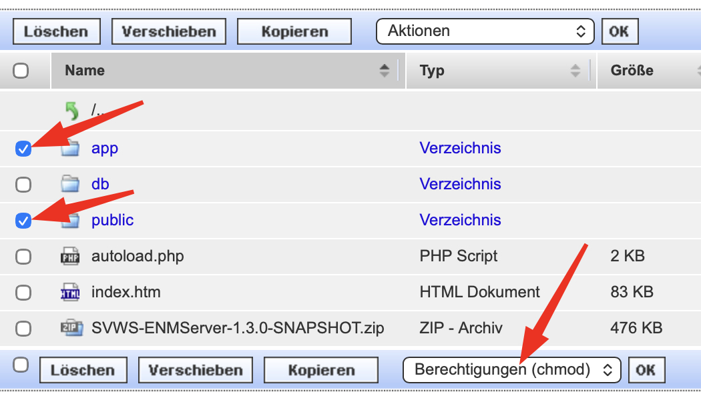
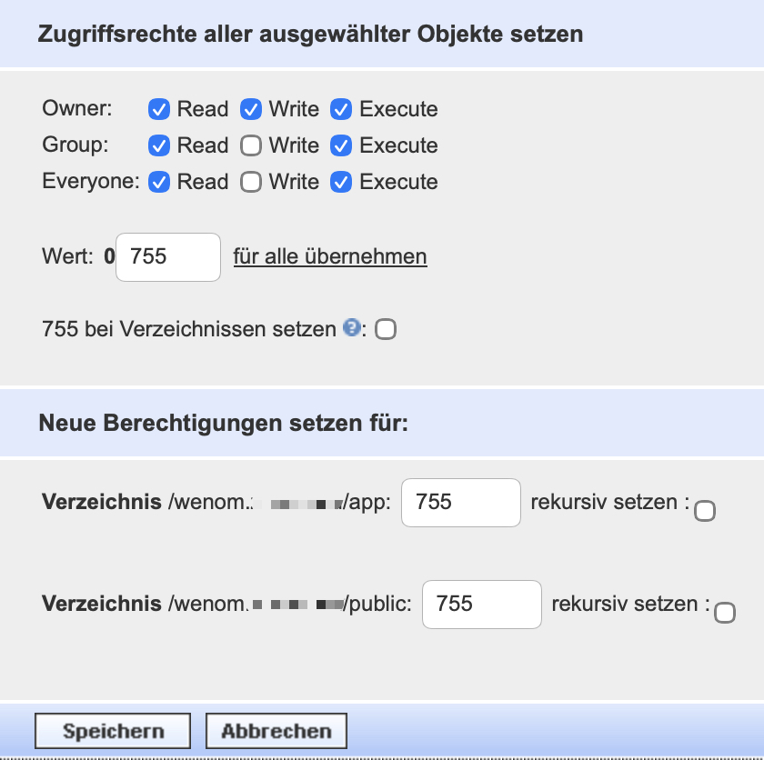
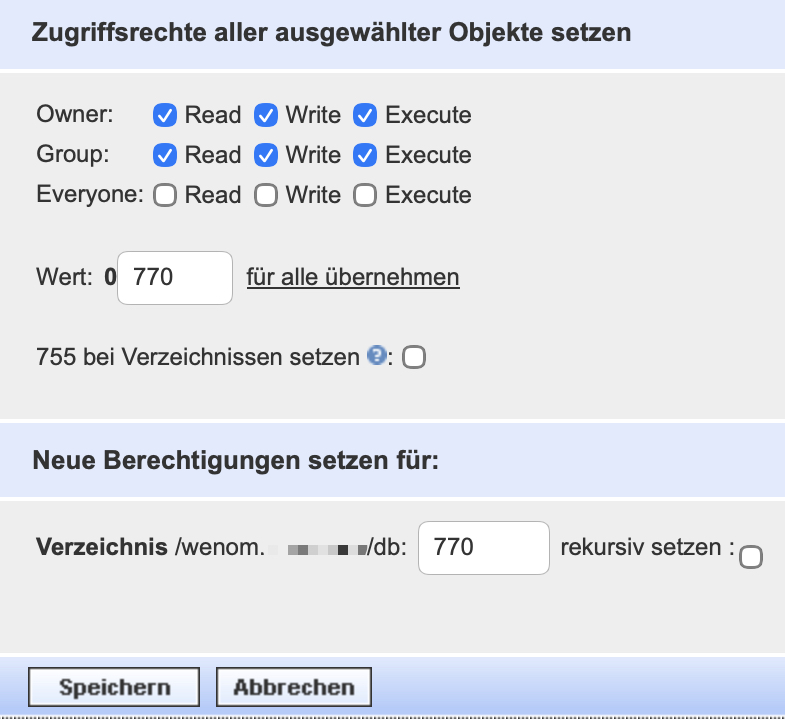
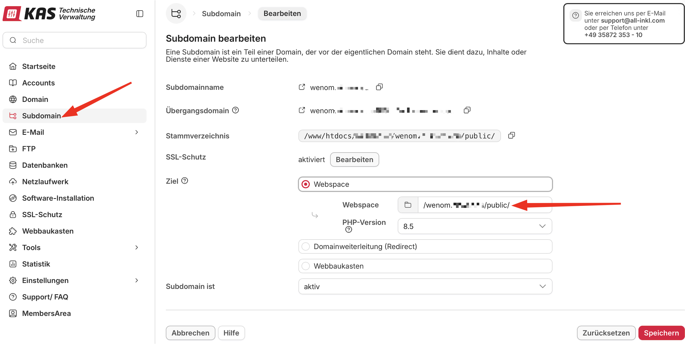

# Webspace All-Inkl

## Voraussetzung

+ Sie haben einen Webspace bei All-Inkl
+ Sie haben einen FTP-Zugang zum Dateisystem des Webhostings
+ Sie benötigen eine Subdomain
+ Sie benötigen ein Zertifikat

## Subdomain anlegen

Loggen Sie sich in den Kundenbereich - Technische Verwaltung (KAS) von All-Inkl ein.
Legen Sie unter "Domains" eine Subdomain an.

Verknüpfen Sie diese Subdomain mit einem SSL-Zertifikat für die sichere Verbindung.

## FTP Verbindung aufbauen, Dateien hochladen und entpacken

Verbinden Sie sich mit Ihrem FTP-User und laden Sie die ZIP-Datei in das Verzeichnis, das mit der gewünschten Subdomain verknüpft wurde. Entpacken Sie die ZIP-Datei

## Berechtigungen von Ordnern ändern
Setzen Sie die Rechte (auf alle Unterordner und Dateien) auf die Ordner Public und App:

Setzen Sie die Rechte  (auf alle Unterordner und Dateien) auf den Ordner db:

Kontrollieren Sie, ob in den Subdomain-Einstellungen als Ziel der /public Ordner eingetragen ist.

